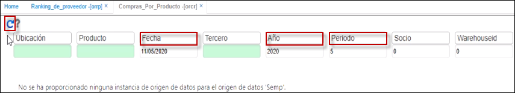
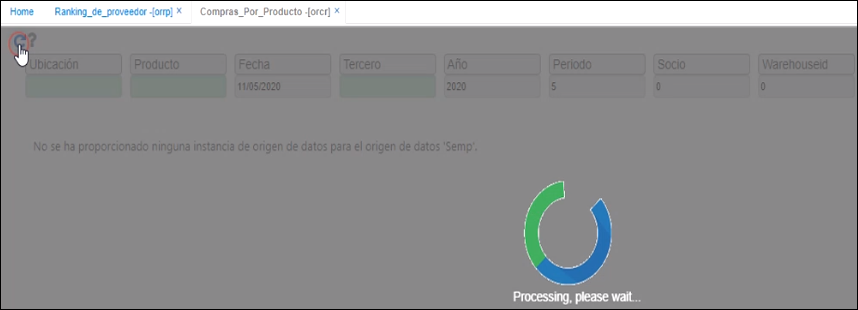

# Compras por producto - ORCR

Dependiendo de los filtros que están en el encabezado o parte superior del reporte, se puede validar las facturas por proveedor hechas en un periodo.  En el caso de ejemplo, la fecha nos muestra por el año y periodo por cada uno de los productos, el documento que se realizó:  a qué proveedor, la cantidad facturada, el valor unitario y el valor total.

  

  

