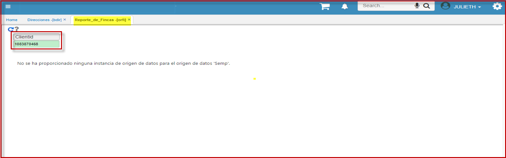
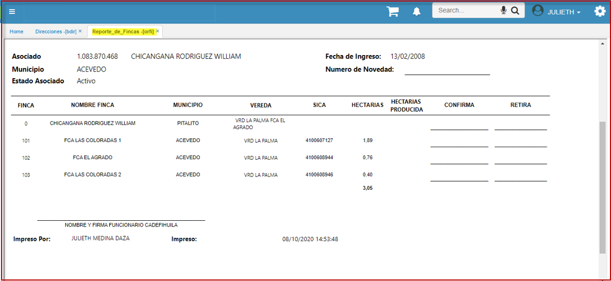

# Reporte de Fincas - ORFI

Reporte en el que se evidencian las fincas que tiene un **asociado**, tal como se cuenta en **BDIR** (direcciones); en ella podrá validar todas las ubicaciones y el usuario podrá dejar como constancia de las fincas a retirar. Para esto se crea el reporte ORFI (reporte de fincas).  

Se ingresa a la aplicación **ORFI** y se digita la cedula del asociado para verificar toda la información en BDIR.  

La información generada corresponde a las fincas por el asociado.  

