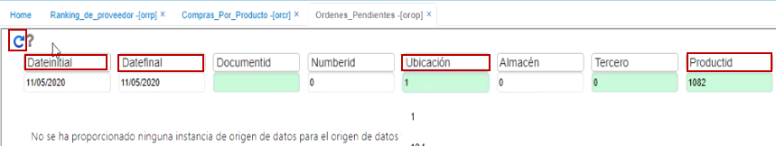
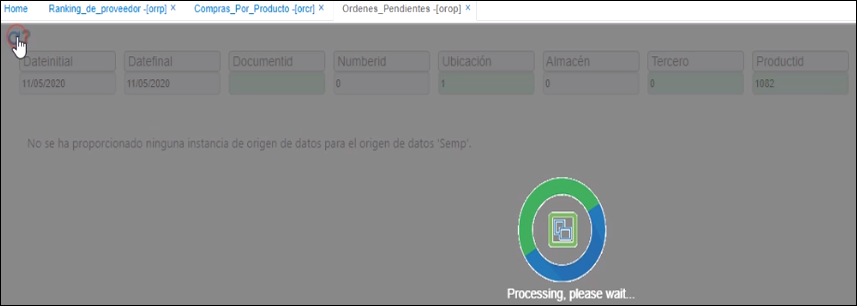
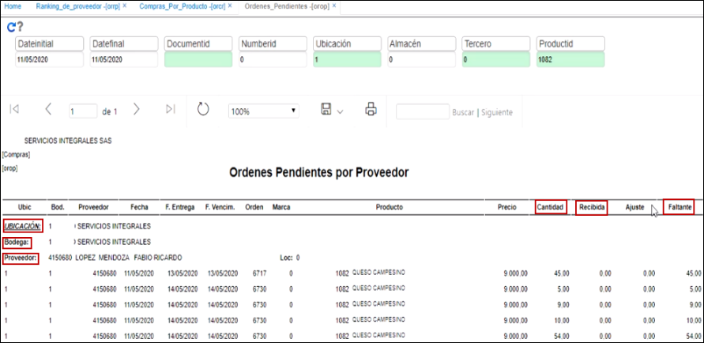

# Órdenes Pendientes - OROP

A través de la validación por rango de fechas, de un producto determinado y de una ubicación específica, este reporte arroja la información de órdenes de compra pendientes por despacho, es decir, que de estas órdenes de compra que muestra el reporte, se han solicitado ciertas cantidades pero no han ingresado o no se ha recibido ninguna o no se han recibido completas, quiere decir que el campo **_Faltante_** debe ser mayor a Cero (0).  

**Cliente ID:** Identificación del proveedor que se desea consultar.  
**Fecha inicial:** Fecha inicial desde donde se desea realizar la consulta.  
**Fecha final:** Fecha final hasta donde se desea realizar la consulta.  

  

