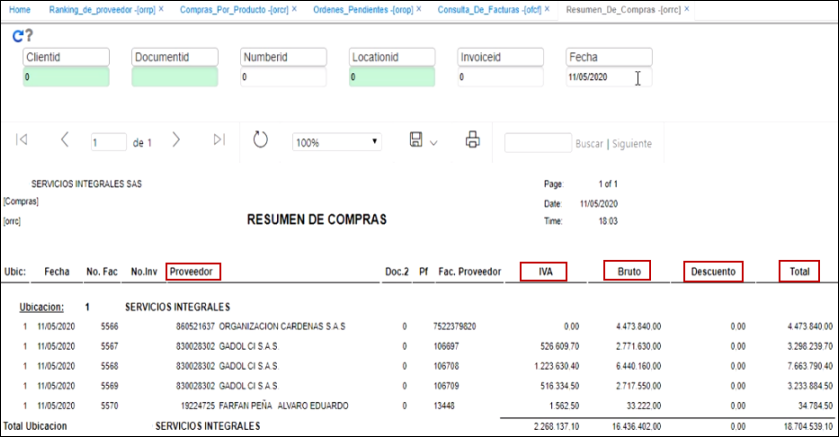

# Resumen de compras - ORRC

En esta aplicación se validan las compras que se le han realizado a cada uno de los proveedores de manera resumida, el valor del IVA, valor bruto, descuento y total de manera discriminada por cada una de las fechas que se relacionen en el encabezado del reporte.  

