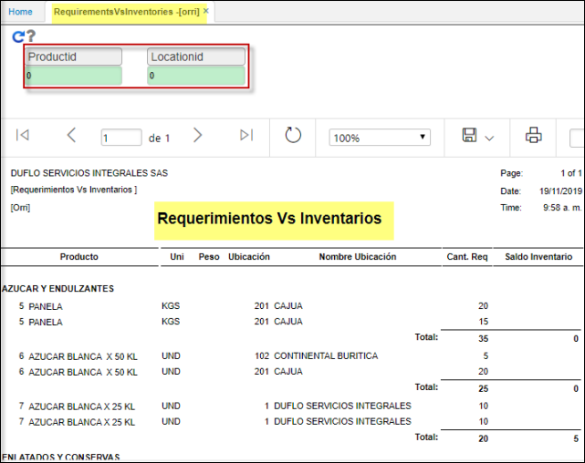
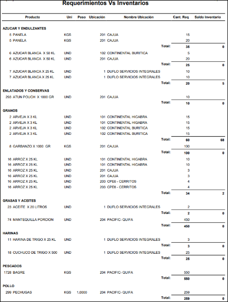

---  
layout: default  
title: Reportes  
permalink: /Operacion/scm/compras/oreporte/orri  
editable: si  
---  

# Requerimientos Vs Inventarios  - ORRI  

Este reporte arroja la información de los requerimientos de compras que se alimentan en OREQ versus el saldo de inventarios.  
El campo cantidad requerida determina las unidades ingresadas en OREQ.  

  

Los parametros de entrada se determinan por Producto y Ubicacion. Poseen zoom de busqueda.  
*  Al exportar el reporte a PDF se visualiza asi:   

  

