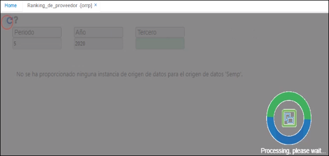

# Ranking de proveedor - ORRP

Reporte que permite visualizar el ranking de proveedores, es decir, muestra un listado donde aparece desde el proveedor al que más le hemos comprado hasta el proveedor al que menos le hemos comprado.  Adicionalmente, nos muestra el porcentaje de participación en el periodo y también muestra el valor acumulado desde el inicio del año hasta la fecha, de la cantidad y el valor de las compras además del porcentaje de participación de ese valor acumulado durante el año.  

  

  

