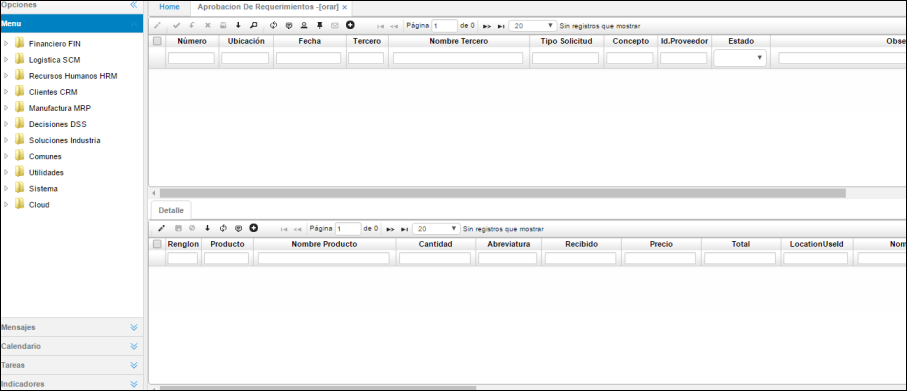

---

layout: default
title: Requerimientos
permalink: /Operacion/scm/compras/orequerimi/orar
editable: si
---

# Aprobación de Requerimientos - ORAR

Esta aplicación permite la consulta de aquellos requerimientos pendientes por aprobación con la indicación de su respectivo detalle.  

En el maestro:

•	**Número:** Número consecutivo de requerimiento. El programa asigna automáticamente este número.  
•	**Ubicación:** Identificación y nombre del lugar desde donde se efectúa el requerimiento.  
•	**Fecha:** Fecha en la cual se genera el requerimiento.  
•	**Solicitante:** Usuario o instancia de donde nace el requerimiento.  
•	**Estado:** Estado en el cual se encuentra el requerimiento.  

En el detalle:

Detalle de los productos y cantidades que se aprobaron. Permite observar la cantidad recibida de cada producto.  

•	**Renglón:** Número de cada fila de productos a solicitar dentro del requerimiento.  
•	**Producto:** Código del producto que se requiere.  
•	**Cantidad:** Cantidad requerida del producto.  
•	**Unidad:** Unidad de medida del producto.  
•	**Recibida:** Cantidad recibida del producto.  
•	**Precio:** Precio sugerido del producto (histórico).  
•	**Estado ítem:** Estado del producto.  
•	**Saldo inventario:** Cantidad de unidades del producto que hay en inventario.  
•	**Consumo:** Cantidad de unidades del producto ya vendidas.  

