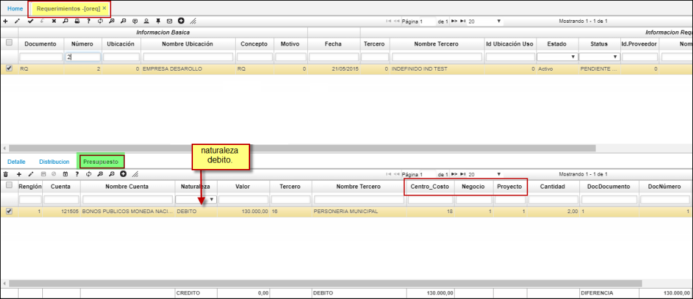

# Requerimientos de Compras- OREQ

La aplicación **OREQ** Un requerimiento de compra puede ser emitida por cualquier área de la empresa tal como: Producción, Marketing, Almacén, Logística, etc.  
Este documento es interno por lo que no debe ser utilizada como Orden de Compra.  
Como todas las aplicaciones de OasisCom se encuentran dividida en secciones: maestro y detalle; en el maestro permite el registro del encabezado de los requerimientos hechos por la empresa; en la parte inferior se divide en pestañas: Detalle, Distribucion y Presupuesto

•	**Número:** Número consecutivo de requerimiento, el cual es asignado automáticamente una vez este respectivamente parametrizado en la opción **BCON**.  
•	**Documento:** Especifica porque se efectúa el requerimiento.  
•	**Fecha:** Fecha en la que se efectúa el requerimiento. El sistema asigna la fecha actual por defecto.  
•	**Ubicación:** Lugar desde donde se efectúa el requerimiento.  
•	**Tercero:** Identificación del posible (sugerido) proveedor que atenderá el requerimiento.  
•	**Prioridad:** (A) alta (M) media (B) baja.  
•	**Estado:** 	Indica el estado o fase en el que se encuentra el requerimiento, el cual puede ser Activo, procesado, Anulado, despacho parcial y terminado.  
•	**Autoriza:** Identificación numérica de la persona o entidad que autoriza el requerimiento.  
•	**Observaciones:** Con respecto al requerimiento. De igual forma esta indicará cuando el requerimiento es generado por el plan de compras quincenal y/o anual.  
•	**Aprueba:** Identificación numérica de la persona o entidad que autoriza el requerimiento.  
•	**Fecha de confirmación:** Fecha de entrega requerida.  

En el detalle de los productos y cantidades que se requieren. Permite observar la cantidad recibida de cada producto.

•	**Renglón:** Número de cada fila de pedido de productos a solicitar dentro del requerimiento.  
•	**Producto:** Código del producto que se requiere.  
•	**Cantidad:** Cantidad requerida del producto.  
•	**Recibido:** Cantidad recibida del producto.  
•	**Unidad:**	Unidad de medida definida para cada producto.  
•	**Precio:** Precio sugerido del producto (histórico).  
•	**Descuento:** Porcentaje de descuento comercial acordado.  
•	**Inventario:** Cantidad de unidades del producto que hay en inventario.  
•	**Requerida:** Cantidad requerida del producto.  

* En la pestaña **Presupuesto:**  
 Su funcinabilidad se establece apartir de la parametrizacion del documento **[BDOC]**, concepto **[BCON]**, plantilla **[BPLA]** o en su defecto: 
 Se insertan los debitos que afectaran presupuestalmente, como se ilustra.  

