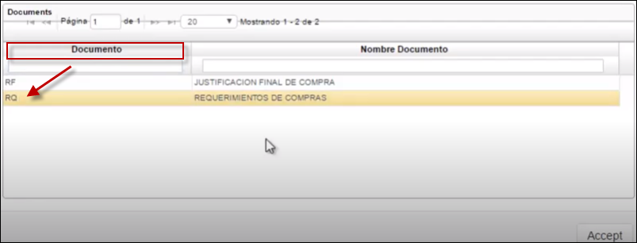
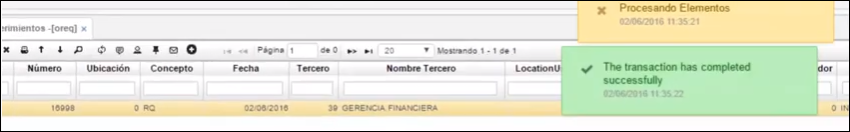
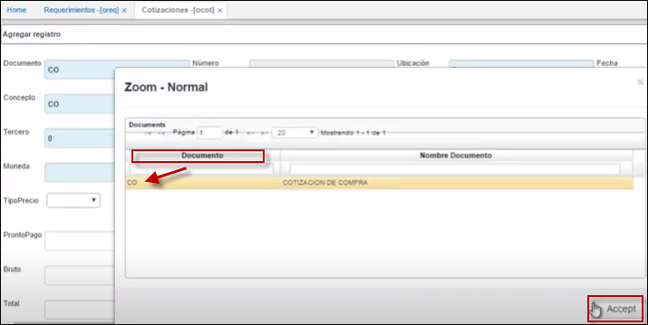
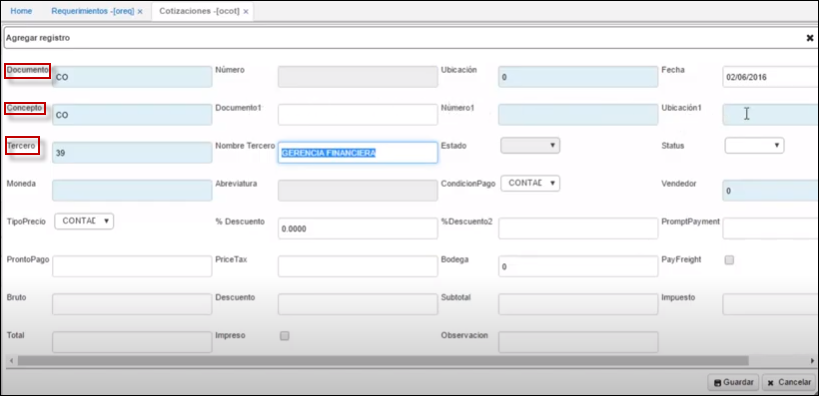
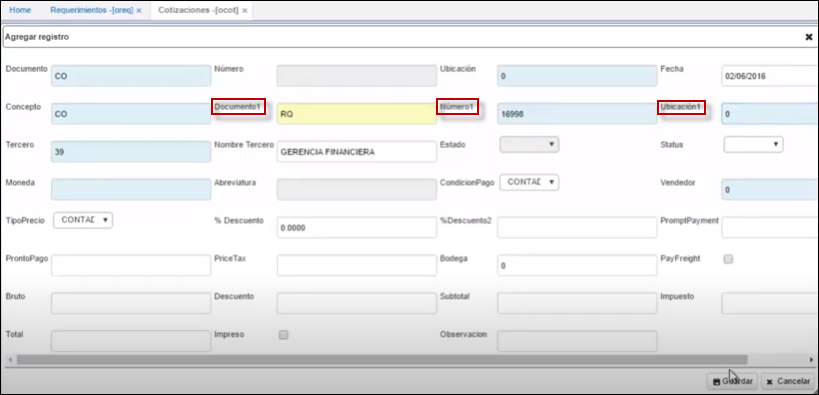

# Requerimientos de Compras- OREQ

La aplicación **OREQ** requerimiento de compras; puede ser emitida por cualquier área de la empresa tal como: Producción, Marketing, Almacén, Logística, etc.  
Este documento es interno por lo que no debe ser utilizada como Orden de Compra.  

>+ [**Cómo hacer un requerimiento una cotización y relacionarlos**](http://docs.oasiscom.com/Operacion/scm/compras/orequerimi/oreq#cómo-hacer-un-requerimiento-una-cotización-y-relacionarlos)

Como todas las aplicaciones de OasisCom se encuentran dividida en secciones: maestro y detalle; en el maestro permite el registro del encabezado de los requerimientos hechos por la empresa; en la parte inferior se divide en pestañas: Detalle, Distribución y Presupuesto

* **Número:** Número consecutivo de requerimiento, el cual es asignado automáticamente una vez este respectivamente parametrizado en la opción **BCON**.  
* **Documento:** Especifica porque se efectúa el requerimiento.  
* **Fecha:** Fecha en la que se efectúa el requerimiento. El sistema asigna la fecha actual por defecto.  
* **Ubicación:** Lugar desde donde se efectúa el requerimiento.  
* **Tercero:** Identificación del posible (sugerido) proveedor que atenderá el requerimiento.  
* **Prioridad:** (A) alta (M) media (B) baja.  
* **Estado:** 	Indica el estado o fase en el que se encuentra el requerimiento, el cual puede ser Activo, procesado, Anulado, despacho parcial y terminado.  
* **Autoriza:** Identificación numérica de la persona o entidad que autoriza el requerimiento.  
* **Observaciones:** Con respecto al requerimiento. De igual forma esta indicará cuando el requerimiento es generado por el plan de compras quincenal y/o anual.  
* **Aprueba:** Identificación numérica de la persona o entidad que autoriza el requerimiento.  
* **Fecha de confirmación:** Fecha de entrega requerida.  

En el detalle de los productos y cantidades que se requieren. Permite observar la cantidad recibida de cada producto.

+ **Renglón:** Número de cada fila de pedido de productos a solicitar dentro del requerimiento.  
+ **Producto:** Código del producto que se requiere.  
+ **Cantidad:** Cantidad requerida del producto.  
+ **Recibido:** Cantidad recibida del producto.  
+ **Unidad:**	Unidad de medida definida para cada producto.  
+ **Precio:** Precio sugerido del producto (histórico).  
+ **Descuento:** Porcentaje de descuento comercial acordado.  
+ **Inventario:** Cantidad de unidades del producto que hay en inventario.  
+ **Requerida:** Cantidad requerida del producto.  
+ **Proyecto:** Parametrización que se realiza en básico de proyectos [**BPRY**]()   

En la pestaña **Presupuesto:**  

Su funcionabilidad se establece a partir de la parametrización del documento: [**BDOC**](), concepto [**BCON**](), plantilla [**BPLA**]() o en su defecto: 
 Se insertan los débitos que afectaran presupuestalmente, registrar el auxiliar contable: centro costo, negocio, proyecto; como se ilustra.  

  

## [**Cómo hacer un requerimiento una cotización y relacionarlos**](http://docs.oasiscom.com/Operacion/scm/compras/orequerimi/oreq#cómo-hacer-un-requerimiento-una-cotización-y-relacionarlos)  

 Se ingresa a la aplicación [**OREQ**]() y se adiciona un nuevo registro (+).  En el campo **_Documento_** se busca por Zoom y se escoge la opción **RQ** de Requerimientos de compras; en el campo **_Concepto_** también se selecciona **RQ**; en el campo **_Tercero_** se selecciona el tercero mediante el zoom y se guarda el registro.  
 
   
 
   
 
   
 
 Luego de diligenciada la parte superior o maestro, se procede a diligenciar la parte inferior o detalle.  En el campo **_Producto_**, se selecciona el producto, el cual debe estar ya parametrizado en la aplicación [**BPRO**]() y se diligencia el campo **_Cantidad_** en caso de ser necesario.  Ahora se guarda el detalle.  
 
  

Posteriormente, se procesa el registro.  

  
 
Si la empresa requiere que una persona en específico apruebe la cotización, esto se puede hacer en la aplicación [**ORAR**]() de Aprobación de requerimientos.  

Ahora se ingresa a la aplicación [**OCOT**]() de Cotizaciones.  Se adiciona un nuevo registro (+).  En el campo **_Documento_** se selecciona **CO** de Cotización de compra; en el campo **_Concepto_** también **CO**; en el campo **_Tercero_** se selecciona el mismo tercero de la aplicación **OREQ**.  

  

  

Luego de diligenciados estos campos, se procede a relacionar el requerimiento con la cotización.  Se inicia con el campo **_Documento1_**.  De ser necesario, se verifica en la aplicación **OREQ** el **_Documento_** y se registra **RQ** y luego en el campo **_Ubicación1_** se registra el mismo ID diligenciado en el campo **_Ubicación_** de la aplicación **OREQ**.  Posteriormente se diligencia el campo **_Número1_**; en este campo, se puede abrir el zoom y seleccionar el requerimiento o si se sabe el número se puede registrar sin necesidad de abrir el zoom y se procede a guardar el registro.  

  

Se guarda el registro y se ve que el sistema trae automáticamente el detalle. Se procede a verificar el detalle y si efectivamente es lo que se quiere cotizar, se procesa el registro.  

  

  

De igual forma que en el anterior proceso, si se necesita que una persona en específico apruebe la cotización, esto se puede parametrizar en la aplicación [**OCAC**]() de Aprobación de compras.  

