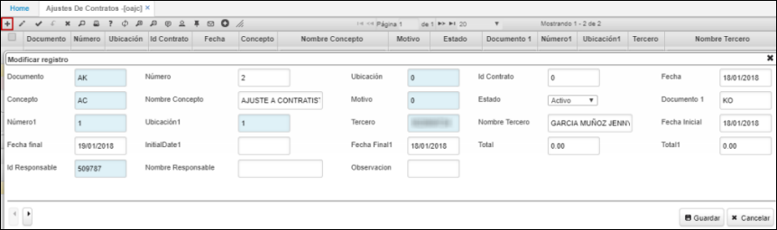
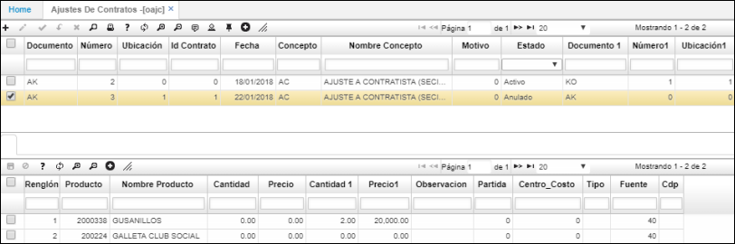

# OAJC - Ajustes de Contrato

La aplicación OAJC permite registrar los ajustes realizados a los contratos de compra.  

Agregamos un nuevo registro en el maestro y diligenciamos los campos, al igual que debemos relacionar en el campo _Número1_ el contrato al cual se le realizará el ajuste. Damos click en _Guardar_.  

**Documento:** seleccionamos del zoom el documento AK correspondiente a Ajustes Contratos de Compra.  
**Número:** el sistema asignará automáticamente el número de consecutivo.  
**Ubicación:** seleccionar del zoom la ubicación en donde se encuentra registrado el contrato. Las ubicaciones son parametrizables en la opción [**Ubicaciones Organización**](http://docs.oasiscom.com/Operacion/common/borgan/bubi) 
****()
****
****
****
****
****
****
****
****

En el detalle de la aplicación se reflejará el producto o servicio por el cual se realizó el contrato.  

Finalmente, procesamos el registro del ajuste al contrato.  

