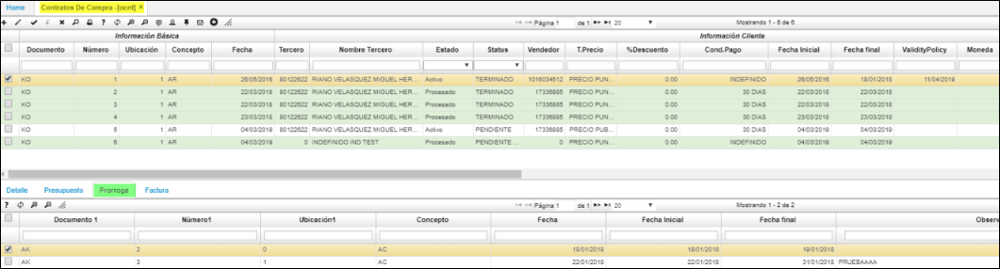

# Contratos de Compra - OCNT

En la aplicación OCNT se realiza el registro, control y/o consulta de los contratos de compra, en donde en el maestro ingresaremos los datos básicos del contrato y en el detalle relacionaremos el producto y/o servicio que se adquiere con el contrato.  

* En la pestaña **Presupuesto:**  
 Su funcionabilidad se establece apartir de la parametrizacion del documento: **[BDOC]**, concepto **[BCON]**, plantilla **[BPLA]** o en su defecto: 
 Se insertan los debitos que afectaran presupuestalmente, registrar los auxilires contable: centro costo, negocio, proyecto; como se ilustra.  
 
 

