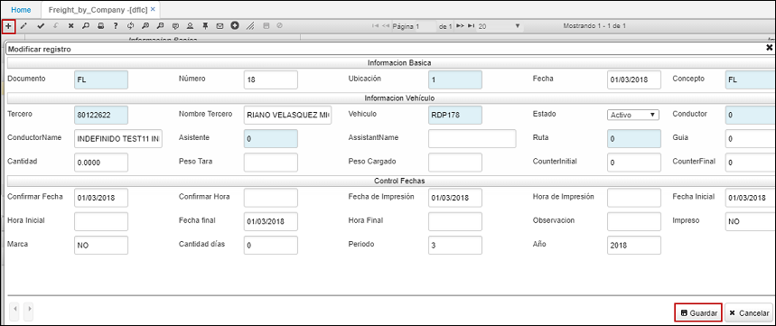
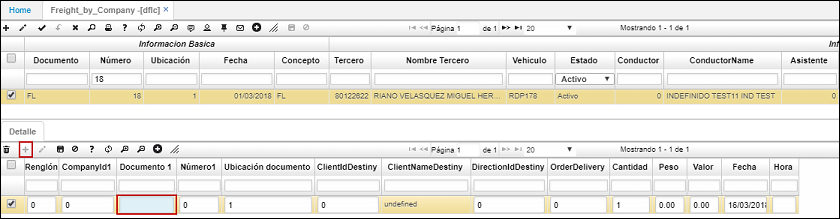
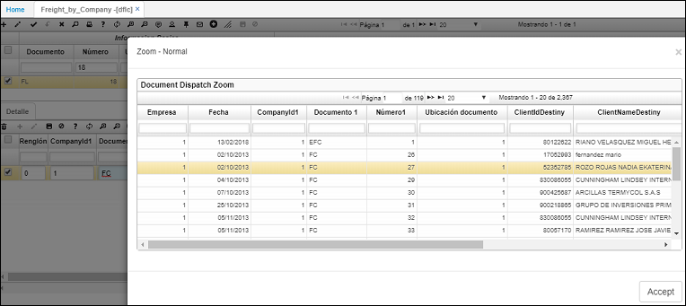
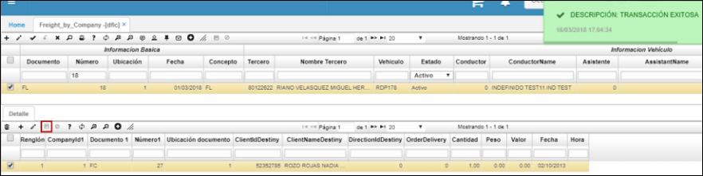
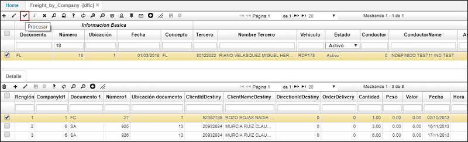
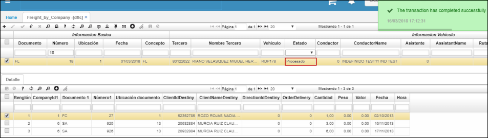

---
layout: default
title: Fletes por Compañía
permalink: /Operacion/scm/distribucion/ddespacho/dflc
editable: si
---

# DFLC - Fletes por Compañía

La aplicación DFLC permite realizar fletes asociando en el detalle documentos de diferentes empresas del dominio a las cuales el usuario logueado tenga acceso.  

Para crear un nuevo flete, damos click en el botón **+** de la barra de herramientas y diligenciamos el formulario.  

La sección de _Información Básica_ será diligenciada automáticamente por el sistema. El consecutivo se asignará en el momento que se guarde el formulario.  

En la sección de _Información Vehículo_ diligenciamos los campos:  

**Tercero:** ingresar el número de identificación del usuario que realiza el flete.  
**Vehículo:** ingresar la placa del vehículo o seleccionarlo del zoom.  
**Conductor:** ingresar el número de identificación del conductor o consultarlo en el zoom dando doble click sobre el campo.  
**Asistente:** ingresar el número de identificación del asistente del vehículo o consultarlo en el zoom.  
**Ruta:** seleccionar del zoom la ruta del vehículo.  

En la sección _Control Fechas_ ingresamos los datos necesarios.  

Damos click en el botón _Guardar_.  



A continuación, registraremos los documentos relacionados al flete en el detalle. Recordemos que se pueden asociar documentos de las diferentes compañías a las que tenga acceso el usuario logueado.  

Agregamos un nuevo renglón y seleccionamos del zoom del campo _Documento1_ el documento correspondiente al flete.  



Seleccionamos el documento y damos click en _Aceptar_.  



Se insertará el documento y procedemos a guardarlo.  



Repetimos el proceso anterior con los documentos necesarios que se deban asociar al flete.  

Para finalizar, debemos procesar el documento desde la barra de herramientas del maestro con el botón _Procesar_. Esto confirmará la creación del flete.  



Al procesar, el sistema arrojará un mensaje de contorl informando que el documento ha sido procesado satisfactoriamente y el estado cambiará a _Procesado_.  



