# Registro de Vehículos - EDRVE

Esta aplicación cumple con su función de formulario para tener control de lo que ingresa a la empresa o sale de esta misma. 

* [Crear Pestaña de Empaque](#crear-pestaña-de-empaque)
* [Destare ](#destare)
* [Ocultar Campos](#ocultar-campos)

## [Crear Pestaña de Empaque](#crear-pestaña-de-empaque)

Botones a visualizar en la aplicación:

| Campos | Descripción |
| --- | ----------- |
| 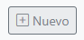 | Nuevo: Crear un nuevo registro. |
|   | Consultar de tipo texto. | 
| 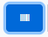| Consultar por código de barras.| 
| 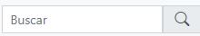| Barra Buscar: Diligenciar el campo con el numero para consultar el registro. | 
| 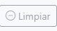| Limpiar: Limpia el registro que se está ingresando para diligenciar uno nuevo.| 
| 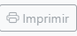| Imprimir: Se imprime el registro para visualizarlo.| 
| | Entrada: Al momento de crear un nuevo registro para el ingreso de un vehículo por motivo de controles, este botón al terminar el formulario se ejecuta y el vehículo por el sistema ingresa y queda registrado. | 
| 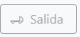| Salida: Al momento de crear un nuevo registro para la salida de un vehículo por motivos de controles sobre lo que sale de la empresa, el botón se ejecuta al momento de terminar de diligenciar el formulario y en el sistema quedara registrado la salida del vehículo.| 
| 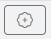| Insertar: El botón se ejecuta cuando el formulario del maestro quede registrado exitosamente. Este con el fin de ingresar el producto que hace entrega.| 
| | Guardar Detalle: Este botón funciona para al momento de diligenciar la información del producto, se verá visualizado.| 
| | Editar: Se edita la información que se diligencio del producto.| 
| | Eliminar: eliminar el registro del producto.| 
| | Detalle: Envía a la pestaña Detalle Detalle | 

A continuación, se ingresa a la aplicación **EDRVE – Registro de Vehículos**, el cual, al momento de ejecutar el botón de **Nuevo**, esta aplicación lanza un formulario y dependiendo de lo que requiera, puede seleccionar que el formulario sea **PRODUCTO PROPIO** o **PRODUCTO DE TERCEROS**. Al seleccionar la opción que se solicite, saldrá el formulario 

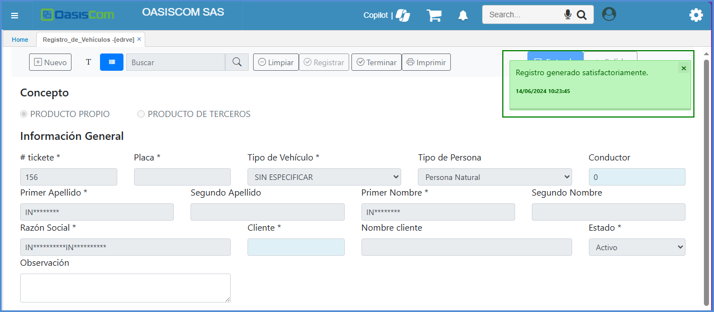

| Campos | Descripción |
| --- | ----------- |
| Tickete | Este campo esta deshabilitado, ya que se diligencia automáticamente por el sistema. |
| Placa | La placa del vehículo que ingresa para descargar. |
| Tipo de persona| Existe la opción de Persona Natural o Persona Jurídica. |
| Conductor| Digitar el número que le corresponde al Conductor que está haciendo la entrega. |
| Razón Social| Si vienen de una Entidad|
| Cliente| El número del cliente debe estar registrado en el [**BTER - Terceros**](https://docs.oasiscom.com/Operacion/common/btercer/bter)|
| Nombre del Cliente| Automáticamente el sistema trae la información del nombre del cliente relacionando el número que registran en el Campo Cliente.|
| Estado| Por defecto se encuentra en Activo, ya que se está ingresando.|
| Observación| Si requieren dejar algún comentario.|

>**Nota:** Todos los campos que contienen el asterisco al lado del nombre son campos obligatorios, dependiendo de la parametrización.  

Una vez el sistema cargue exitosamente el registro, saldrá unos nuevos campos en la parte de abajo el cual es para ingresar el producto que se recibe. 

Al ejecutar el botón **Insertar.** 

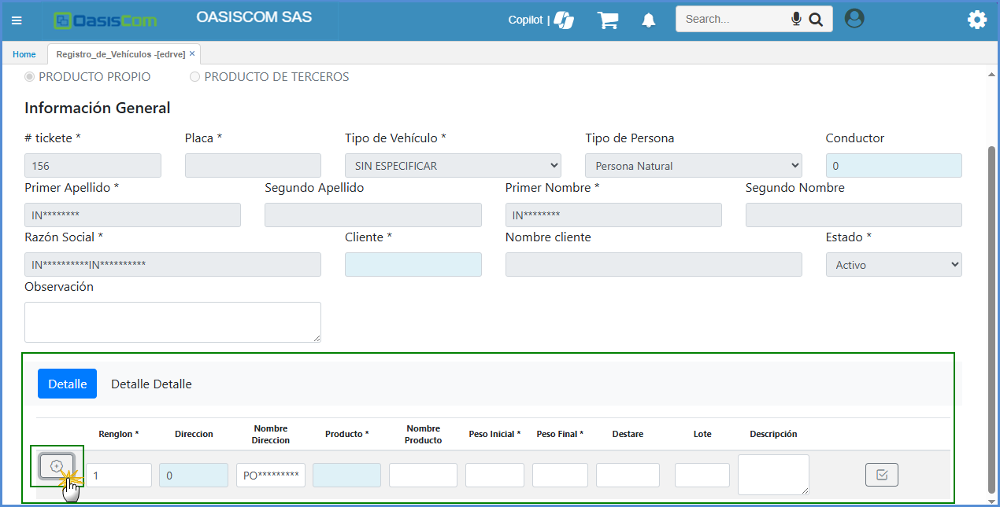

| Campos | Descripción |
| --- | ----------- |
| Renglón         | Este campo no se modifica, ya que cuando se ingrese el registro, esto automáticamente hace el consecutivo.      |
| Dirección       | Por defecto se encuentra el 0. Sin embargo, se ingresa el que corresponde. |
| Nombre Dirección| Se refleja el nombre de la dirección.|
| Producto        | Producto que se selecciona el cual se encuentra registrados en la aplicación [**BPRO - Productos**](https://docs.oasiscom.com/Operacion/common/bprodu/bpro).|
| Nombre de Producto| Se visualiza el nombre del producto que fue seleccionado.|
| Peso Inicial    | Se ingresa el peso de la mercancía Ejemplo: 10000.|
| Peso Final      | Se ingresa el peso de la mercancía Ejemplo: 3000. El cual, para esto, el peso real es de 7000 (Todos los datos los pone el usuario). |
| Destare         | Este campo se explicará posteriormente.|
| Lote           | Por defecto se encuentra 0.|

Al ingresar toda la información necesaria del producto, se puede ejecutar el botón para que se haga el calculo

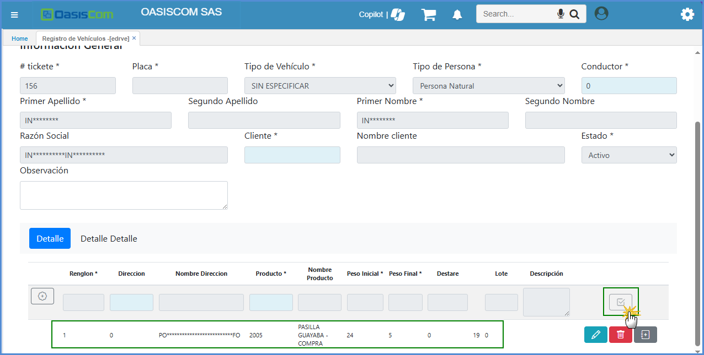

Una vez registrado el producto, en la pestaña **Detalle Detalle** se ingresa ejecutando el botón gris de **Detalle**

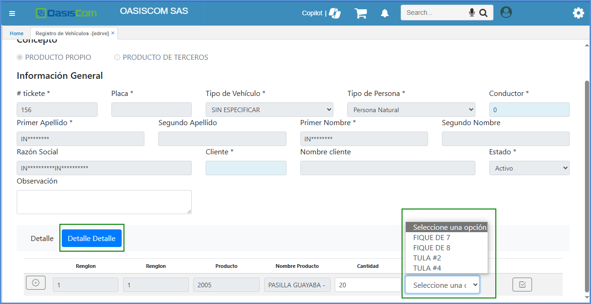

| Campos | Descripción |
| --- | ----------- |
| Campos Renglón | El sistema los registra automáticamente. |
| Producto | Se refleja el producto que seleccionaron en la pestaña Detalle. |
| Nombre Producto| Nombre del producto.|
| Cantidad| La cantidad de productos que ingresan.|
| Tipo| Están las opciones - **FIQUE DE 7**, **FIQUE DE 8**, **TULA #2** y **TULA #4.** |

## [Destare](#destare)

Esto se encuentra parametrizado en la aplicación [**BCRC - Características**](https://docs.oasiscom.com/Operacion/common/bcomer/bcrc), toma la cantidad que se ingresó en la pestaña **Detalle Detalle** y se multiplica por tipo, este resultado es el **Destare**. Cuando se registra otro producto ejecuta la multiplicación y suma el **Destare** del producto anterior y en el **detalle**, el resultado se muestra acumulado, tal como se muestra en la imagen.

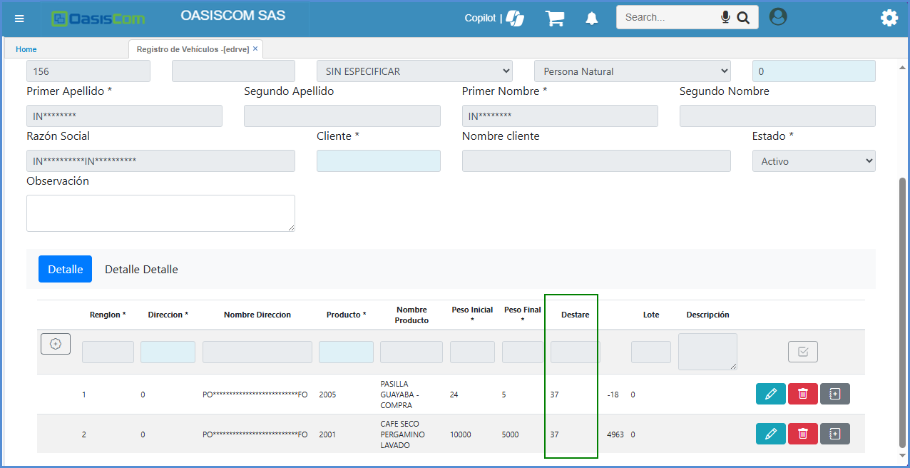

Lo que se ingresa por la aplicación **EDRVE-Registro de Vehículos**, se puede visualizar en la aplicación **DRVE-Registro de Vehículos**.

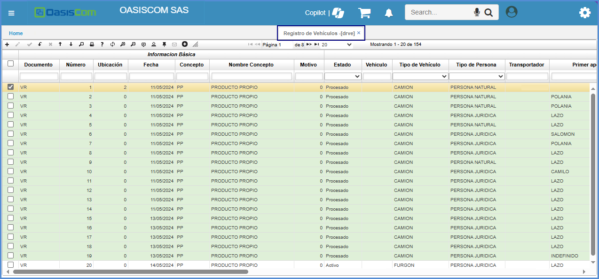

## [Ocultar Campos](#ocultar-campos)

La aplicación **EDRVE-Registro de Vehículos** también permite ocultar campos por medio de parametrización. Esta se realiza en la aplicación **SROL - Roles**. 
Para ejemplo de la imagen corresponde al **Rol 99**.

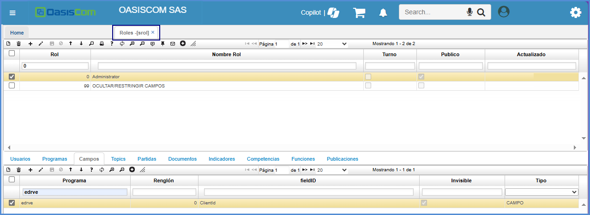

Para este escenario, se ocultó el campo Cliente por lo cual en el **SROL** se registra como **ClientId**.

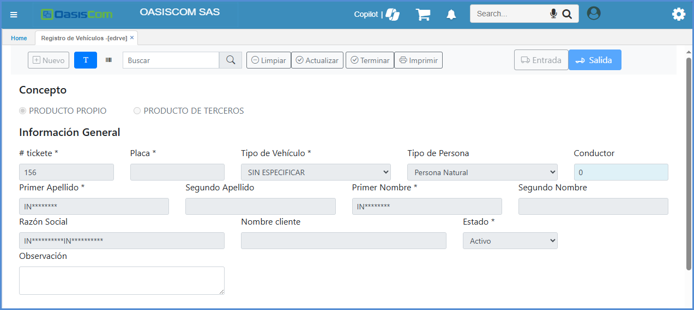

Como se puede visualizar en la imagen anterior el Campo **Cliente** esta oculto.
