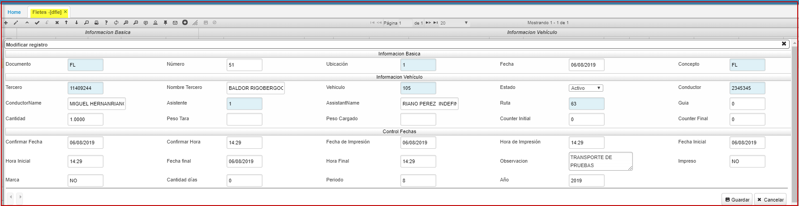
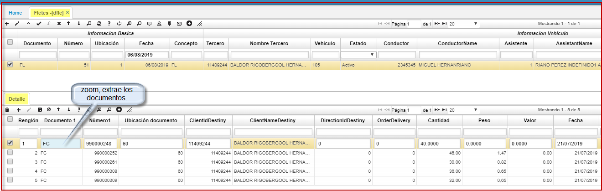

# DFLE - Fletes  

Aplicación del modulo de Distribución que permite; relacionar el valor del traslado de mercancías en un medio de transporte, asocia facturas o movimientos de inventario de un tercero determinado.  
En el siguiente formulario relacionamos: documento, número y ubicación que corresponde a las llaves primarias. No pueden ser modificadas después de ser guardados los mencionados campos.  
El campo tercero corresponde al cliente donde va la mercancía. Existen campos como vehículo, ruta, conductor, asistente los cuales deben de ser parametrizados y guardar el maestro del **DFLE**.  

  

Se visualizará como se ilustra, en el detalle del **DFLE** al insertar el primer renglón utilizamos el zoom de ayuda para extraer los documentos.  

  

Para este ejemplo seleccionamos al cliente con cedula 11409244 y relacionamos cinco facturas.  

  

El proceso finaliza al procesar el documento dando click en el botón.  
Se imprime, para realizar el proceso logístico de traslado de la mercancía con su respectivo flete.  

