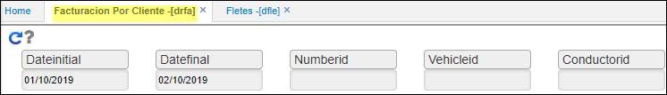
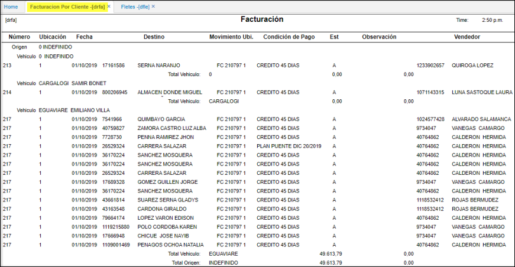

---  
layout: default  
title: Facturación por cliente  
permalink: /Operacion/scm/distribucion/dreporte/drfa  
editable: si  
---  

# DRFA - Facturación por cliente  

Reporte del modulo de Distribucion, donde se extrae la informacion de los fletes **DFLE**.   Denominado Facturacion por cliente. **DRFA**  
Datos de entrada.  
**Fecha inicial:
Fecha final:
Numero:
Vehiculo:
Conductor:**

Al ejecutar la consulta, realiza el agrupamiento por Vehiculo y Conductor.  

