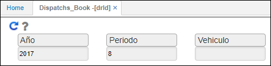
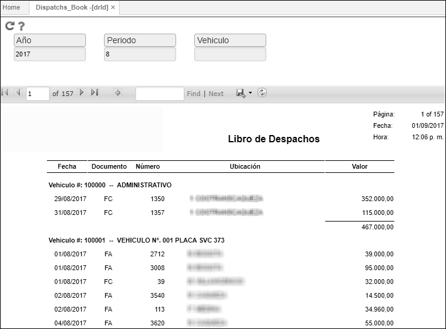

# DRLD - Libro de Despachos

La aplicación DRLD es una ventana tipo reporte que permite la visualización de despachos de vehículos.  

La aplicación permite realizar el filtro de la consulta por año, periodo y vehículo. Si se desean consultar todos los vehículos, no ingresamos ningún dato en el campo _Vehículo_.  

