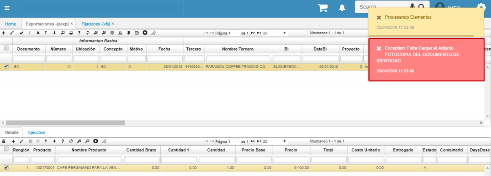
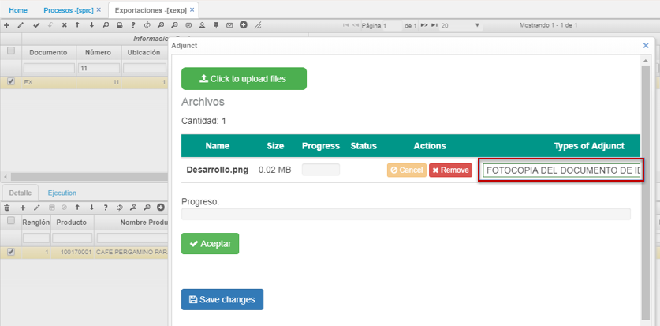

# XEXP - Exportaciones

La aplicación **XEXP** permite administrar las exportaciones de una compañía y realizar el respectivo seguimiento de las mismas.  

En el maestro, se debe crear un documento _EX (Exportaciones)_ con concepto _EX_. Para agregar un nuevo documento de exportación, damos click en el botón _Agregar nueva fila_  y diligenciamos el formulario con los datos correspondientes a la exportación a realizar.  

**Tercero:** Este campo debe ser el mismo que se ingresó en la opción VFIJ o VPED.  
**BL:** Que corresponde al número de documento de transporte marítimo.  
**Fecha Orden:** Corresponde a la fecha del contrato.  
**Orden de Compra:** En este campo se debe ingresar el número de contrato u orden de compra correspondiente.  
**Forma de Pago:** Corresponde a la condición de pago. El campo es un ListBox para selección de opción. Este campo viene de la parametrización de la opción BFOR.  
**Envío:** Corresponde a la fecha de embarque del producto .  

En los campos _Documento1, Ubicación1 y Número1_ relacionaremos el pedido para exportación realizado previamente en la aplicación [**VPED - Pedidos**](http://docs.oasiscom.com/Operacion/scm/ventas/vpedido/vped).  

**Documento1:** documento PD (Pedidos).  
**Ubicación:** indicar la ubicación definida en la aplicación [**VPED - Pedidos**](http://docs.oasiscom.com/Operacion/scm/ventas/vpedido/vped) para dicho pedido.  
**Número1:** ingresar el número de consecutivo del pedido a relacionar en la exportación o dar doble click sobre el campo y seleccionarlo del zoom.  

**Tipo de Transporte:** se diligencia el tipo de transporte que realizará la exportación, el campo cuenta con zoom de ayuda el cual retorna el Id del tipo de transporte elegido.  
**Incoterms:** en este campo se ingresa el término de tres letras, el cual permitirá conocer los conceptos de liquidación de la exportación. Se deben parametrizar por medio de la aplicación [**BINC - Incoterms**](http://docs.oasiscom.com/Operacion/common/bcomer/binc).  
**CustomsId:** este campo indica la aduana previamente parametrizada en la opción [**BADU - Aduanas**](http://docs.oasiscom.com/Operacion/common/bcomer/badu).  
**Buque (Naviera):** en este campo se debe diligenciar la empresa de transporte marítimo que se encargará del transporte del producto. Este campo es abierto.  
**País de Origen:** se debe ingresar el país de donde saldrá el producto.  
**País de Compra:** se debe ingresar el país de compra del producto.  
**País de Envío:** se debe ingresar el país de envío del producto.   
**País de Destino:** se debe ingresar el país de destino del producto.  

_**Nota:** estos últimos campos cuentan con zoom de ayuda para seleccionar el país. Retornarán el id del país elegido._  

**Puerto de Envío:** se debe ingresar el puerto de envío del producto.  
**Puerto de Destino:** se debe ingresar el puerto de destino del producto.  

_**Nota:** estos campos son abiertos para el usuario._  

**Referencia1:** corresponde al número de la reserva. Este campo es abierto para el usuario.  

Diligenciado el formulario y damos click en _Guardar_.  

En el detalle, veremos los productos relacionados con el pedido asociado anteriormente en el maestro de la aplicación XEXP, estos serán los productos de exportación.  

**Cantidad Bruto:** este campo se maneja en sacos para la exportación de café, para cualquier otra empresa es la cantidad bruta del producto en cuestión.  
**Precio:** corresponde al valor de la negociación inicial. Este precio inicial varía con la liquidación de la exportación.  

Una vez creado el maestro y el detalle, nótese que al intentar procesar el registro, el sistema muestra un mensaje de control indicando que requiere adjuntar documentos, los cuales son requeridos para la realización del proceso de exportación. Dichos documentos se deben parametrizar previamente en la aplicación [**BMOT - Motivos**](http://docs.oasiscom.com/Operacion/common/bsistema/bmot#parametrización-de-adjuntos) _Ver aplicación_.  

Se debe adjuntar el documento para poder así procesar el documento.  

Adjunto el archivo, finalmente procesamos el documento dando click en el botón _Procesar_  ubicado en la barra de herramientas del maestro.  

La aplicación **XEXP** cuenta con una vista previa que permite visualizar el documento de exportación y descargarlo en formato Excel, PDF o Word.  

Para ver el documento damos click en el botón  de la barra de herramientas.  

# [Liquidación de Exportaciones](http://docs.oasiscom.com/Operacion/scm/exportaciones/xexportaciones/xexp#liquidación-de-exportaciones)

Para hacer una liquidación de una exportación se deben tener creados los parámetros básicos de las aplicaciones: [**BADU - Aduanas**](http://docs.oasiscom.com/Operacion/common/bcomer/badu), [**BCON - Conceptos**](http://docs.oasiscom.com/Operacion/common/bsistema/bcon#liquidación-de-exportaciones), [**BADC - Costos por aduana**](http://docs.oasiscom.com/Operacion/common/bcomer/badc) y por último  la aplicación [**BINC - Inconterms**](http://docs.oasiscom.com/Operacion/common/bcomer/binc) en la cual se agrupan los conceptos deseados de una exportacion. _Ver aplicaciones_.  

Agregamos un nuevo formulario y diligenciamos los campos. Allí relacionaremos el Incoterms correspondiente.  

En el detalle asociaremos los productos de exportación. Allí mismo encontraremos un botón con el cual se liquida la exportación. Las exportaciones para el siguiente ejemplo, se liquidan por renglón y deben calcular el costo y el precio.  

Para un mejor análisis, en la pestaña de conceptos se visualiza la liquidación de los conceptos de exportación.  

