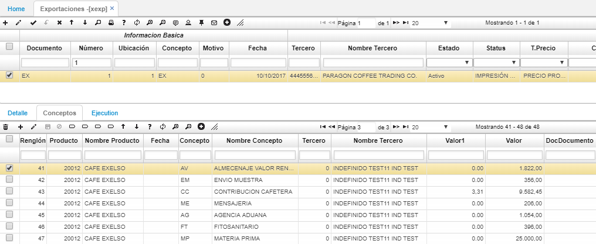

# XEXP - Exportaciones

La aplicación **XEXP** permite administrar las exportaciones de una compañía y realizar el respectivo seguimiento de las mismas.  

Para agregar un nuevo documento de exportación, damos click en el botón _Agregar nueva fila_  y diligenciamos el formulario con los datos correspondientes a la exportación a realizar.  

En los campos _Documento1, Ubicación1 y Número1_ relacionaremos el pedido para exportación realizado previamente en la aplicación [**VPED - Pedidos**](http://docs.oasiscom.com/Operacion/scm/ventas/vpedido/vped).  

**Documento1:** documento PD (Pedidos).  
**Ubicación:** indicar la ubicación definida en la aplicación [**VPED - Pedidos**](http://docs.oasiscom.com/Operacion/scm/ventas/vpedido/vped) para dicho pedido.  
**Número1:** ingresar el número de consecutivo del pedido a relacionar en la exportación o dar doble click sobre el campo y seleccionarlo del zoom.  

Diligenciamos el formulario y damos click en _Guardar_.  

En el detalle, veremos los productos relacionados con el pedido asociado anteriormente en el maestro de la aplicación XEXP.  

Finalmente procesamos el documento dando click en el botón _Procesar_  ubicado en la barra de herramientas del maestro.  

La aplicación **XEXP** cuenta con una vista previa que permite visualizar el documento de exportación y descargarlo en formato Excel, PDF o Word.  

Para ver el documento damos click en el botón  de la barra de herramientas.  

# [Liquidación de Exportaciones](http://docs.oasiscom.com/Operacion/scm/exportaciones/xexportaciones/xexp#liquidación-de-exportaciones)

Para hacer una liquidación de una exportación se deben tener creados los parámetros básicos de las aplicaciones: [**BADU - Aduanas**](http://docs.oasiscom.com/Operacion/common/bcomer/badu), [**BCON - Conceptos**](http://docs.oasiscom.com/Operacion/common/bsistema/bcon#liquidación-de-exportaciones), [**BADC - Costos por aduana**](http://docs.oasiscom.com/Operacion/common/bcomer/badc) y por último  la aplicación [**BINC - Inconterms**](http://docs.oasiscom.com/Operacion/common/bcomer/binc) en la cual se agrupan los conceptos deseados de una exportacion. _Ver aplicaciones_.  

Agregamos un nuevo formulario y diligenciamos los campos. Allí relacionaremos el Incoterms correspondiente.  

En el detalle asociaremos los productos de exportación. Allí mismo encontraremos un botón con el cual se liquida la exportación. Las exportaciones para el siguiente ejemplo, se liquidan por renglón y deben calcular el costo y el precio.  

Para un mejor análisis, en la pestaña de conceptos se visualiza la liquidación de los conceptos de exportación.  

