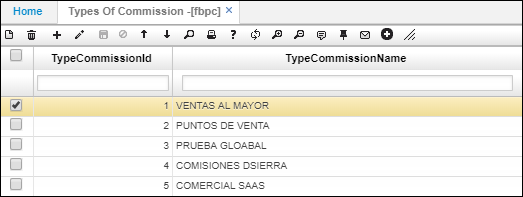
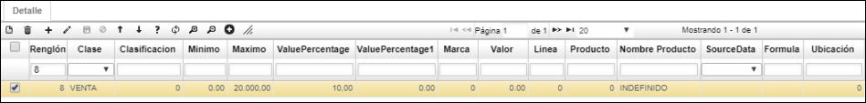
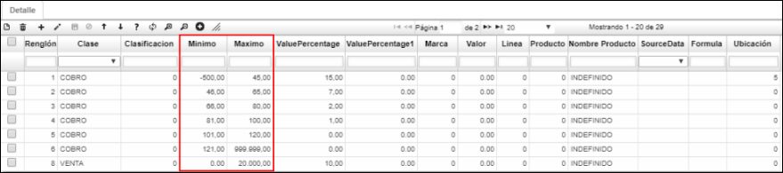
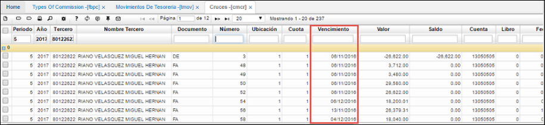
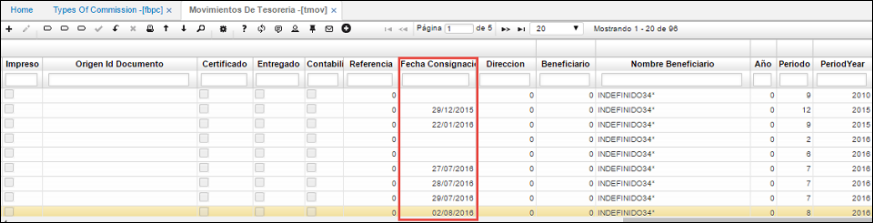
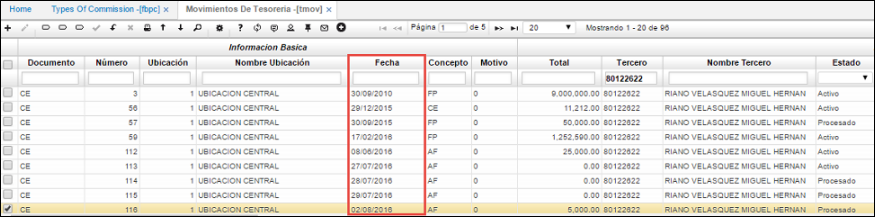
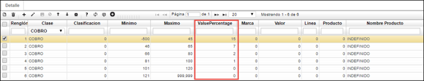
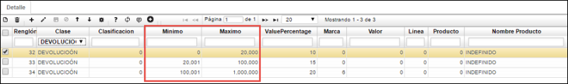
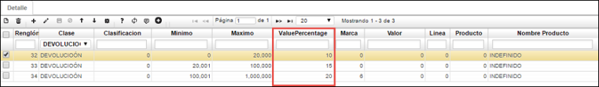

---
layout: default
title: Tipos de Comisión
permalink: /Operacion/scm/facturacion/fbasica/fbpc
editable: si
---

# FBPC - Tipos de Comisión

## Liquidación de Comisiones

Para realizar el proceso de _Liquidación de Comisiones_ se deberá parametrizar inicialmente los tipos de comisión en la aplicación _FBPC_.  

**Maestro**

- En el campo _TypeCommissionId_ (Id Tipo Comisión), se debe ingresar el Id de la comisión (teniendo en cuenta que este es un identificador único).  

- En el campo _TypeCommissionName_ (Nombre Tipo de Comisión), se debe ingresar el nombre del tipo de comisión a crear.  



**Detalle**

- En el campo _Clase_, se deberá seleccionar la clase del tipo de comisión. Las principales son:  

	- Venta
	- Cobro
	- Devolución

Cuando la clase corresponde a _**VENTA**_:



-	En el campo **Clasificación**, se deberá seleccionar la clasificación de productos a los que aplicará este tipo de comisión. Se debe tener en cuenta que, si este corresponde a **0**, aplicará para todas las clasificaciones.  

-	Los campos **Mínimo** y **Máximo** corresponden a los rangos en precio (valor subtotal de los documentos de facturación) en los que aplicará el tipo de comisión.  

-	El campo **ValuePercentage**, corresponde al porcentaje de descuento que se realizará, teniendo en cuenta el valor en ventas estipuladas en los campos _Mínimo_ y _Máximo_.  

-	En el campo **Marca** se debe seleccionar la marca del producto al que aplicará el tipo de comisión. Se debe tener en cuenta que, si este corresponde a **0**, aplicará para todas las marcas.  

-	En el campo **Línea**, se debe seleccionar la línea a la cual aplicará el tipo de comisión. Se debe tener en cuenta que, si este corresponde a **0**, aplicará para todas las líneas.  

-	En el campo **Producto**, se deberá seleccionar el producto al cual aplicará el tipo de comisión. Se debe tener en cuenta que, si este corresponde a **0**, aplicará para todos los productos.  

-	El campo **Nombre Producto**, se llenará conforme a lo ingresado en el campo _Producto_.  

- En el campo **Ubicación**, se deberá ingresar la ubicación a la cual se asgina una clase.  

Cuando la clase corresponde a _**COBRO**_:  

- En los campos **Mínimo** y **Máximo** se deberá ingresar el rango de días (de pago), en donde el campo mínimo puede recibir valores negativos. Teniendo en cuenta que:  



Se realizará el cobro teniendo en cuenta la _fecha de vencimiento_ de la opción [_**CMCR - Cruces**_](http://docs.oasiscom.com/Operacion/erp/cartera/cmovimient/cmcr), en donde el mínimo de días puede llegar a ser negativos dado que la _fecha de vencimiento_ siempre será contada en días hacia delante de la fecha del documento de ventas:  



Y la _fecha de consignación_ de la opción [_**TMOV - Movimientos de Tesorería**_](http://docs.oasiscom.com/Operacion/erp/tesoreria/tmovimient/tmov) del recibo de caja que se está facturando, dado que este si se muestra en días anteriores o posteriores a la fecha del documento que se está cancelando.  



_**IMPORTANTE**_: Si este campo (Fecha de Consignación) no contiene ninguna fecha (está vacío), el sistema tomará la fecha del recibo de caja de esta misma opción:



- En el campo **ValuePercentage** se ingresará el porcentaje de descuento que se aplicará de acuerdo al rango de días ingresados en los campos _Mínimo_ y _Máximo_.



Los demás campos del detalle, se diligencian de la misma forma descrita previamente.  

Cuando la clase corresponde a _**DEVOLUCIÓN**_. Cuando se realizan devoluciones de las ventas realizadas:  

- En los campos _Mínimo_ y _Máximo_ se debe ingresar el rango de valor en precio (valor subtotal de los documentos de facturación) 	en caso de que se realice alguna devolución.  



-	En el campo _ValuePercentage_ se debe ingresar el porcentaje de descuento que se aplicará en el rango establecido cuando se realice tal devolución.  



Los demás campos se diligencian de la misma manera como se explicó anteriormente.  


Para designar un _tipo de comisión_ a un tercero o cliente, se realizará la parametrización en la aplicación [**BTER - Terceros**](http://docs.oasiscom.com/Operacion/common/btercer/bter).




