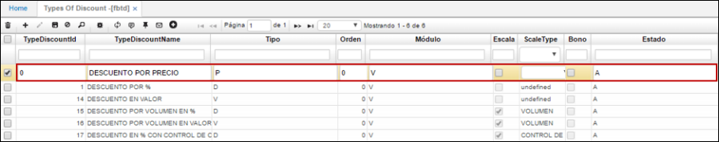

# Tipo de Descuento - FBTD

La aplicación **FBTD** permite parametrizar los tipos de descuentos que se utilizarán en el módulo de facturación.

**Id Tipo de descuento:** se ingresa el Id del descuento. Se debe tener en cuenta que este Id no es un consecutivo, pero si debe ser un número exclusivo al momento de crear un tipo de descuento.  
**Nombre del tipo de descuento:** nombre asignado al tipo de descuento.  
**Tipo:** se ingresa el tipo de descuento que se está creando. Se debe tener en cuenta que este campo debe ser llenado con las siguientes letras:  

  **P: Precio** Aplica para descuentos por precio.  
  **D: Descuento** Aplica para descuentos por %.  
  **V: Valor** Aplica para descuentos por valor.  

**Módulo:** la letra **V** significa que el tipo de descuento creado aplica para las aplicaciones de Ventas.  
**Escala:** corresponde a un **check**, el cual indica que se manejan rangos para los tipos de descuento por Volumen y por Control de Cantidad.  
**ScaleType:** se determina si el tipo de descuento creado corresponde a un rango. En este caso aplica para los descuentos por volumen y control de cantidad dado que estos manejan cantidades.  
**Estado:** debe ser llenado con las siguientes letras:  

  **A:** Activo.  
  **I:** Inactivo.  

**_Nota:_** Se debe tener en cuenta que, si el estado del tipo de descuento es Inactivo **I**, este no será aplicado a ningún producto en caso de ser parametrizado.  

Parametrizados los tipos de descuentos, ahora se deben realizar las listas de precios de los productos en la aplicación [**FPRE - Precios**](http://docs.oasiscom.com/Operacion/scm/facturacion/fprecio/fpre). (_Ver aplicación_).  
