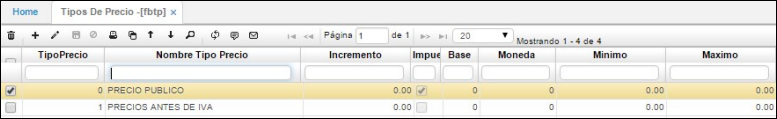

# Tipo de Precios - FBTP

Los tipos de precios son las diferentes listas de precios que pueda tener vigente en un momento dado la empresa. Normalmente las empresas pueden ofrecer dos listas de precios al tiempo, que son mayorista y público. Si una empresa tiene definidas muchas listas de precios aquí se deben definir cada una de esas listas de precios.

**Código:** Código que identifica los Tipos de Precio de acuerdo a las definidas por la empresa.  
**Nombre:** Código de la cuenta contable correspondiente al concepto, es de indispensable definición ya que, de esta depende el informe consolidado de facturación para la generación del comprobante de contabilidad.  
**IVA:** La lista de precios puede incluir en el valor el valor del IVA, en tal caso al momento de la venta el sistema calcula hacia atrás su monto y lo indica en la factura. Aplica por lo general para la lista de Precio Venta Publico (PVP).  
**Moneda:** Tipo de moneda que manejará la lista de precios. Permite manejar listas independientes para las distintas monedas en las que se efectúan transacciones.  
**Tipo Base:** Indica que dicha lista es una variación a otra (base).  
**% Variación:** La lista de precios puede variar unas a otras (porcentaje positivo) o disminuciones (porcentaje negativo).  
**Mínimo/Máximo:** Rango para el cual aplica el tipo de precio establecido.  

