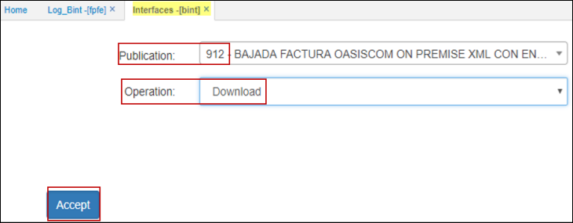
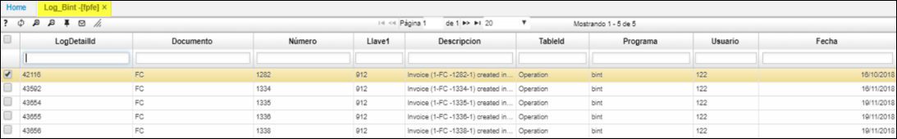

# Log Bint - FPFE

Esta funcionabilidad se ejecuta al realizar las siguientes parametrizaciones en:
* [BPUB] publicaciones.  
* [FFAC] facturas.  
• [BINT] interfaces.  
Los datos se reflejan en [FPFE].  

  

Parametrización a realizar:  
* Desde la publicación [BPUB] debe de estar prendido el check del campo: **Publication** según publicación que desea ser aplicada. Como se ilustra.  

  

* Desde [FFAC] debe de validar que estas facturas existan si va a utilizar el rango de fecha.  
* Ejecutar la interface [BINT] 912.  

  
Después de ejecutar la interface se produce el cambio, como se ilustra.  

Los datos se reflejan en [FPFE].  

