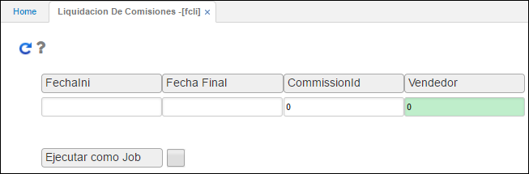

# Liquidación de Comisiones - FCLI

La opción **FCLI** permite generar un reporte por pantalla o impreso de la liquidación de las comisiones acumuladas por cada uno de los vendedores teniendo en cuenta el rango de fechas a generar las mismas, el tipo de comisión y el vendedor sobre el cual se desea ejecutar este proceso. Igualmente, permite hacer el pago de las comisiones por tesorería o por nómina.  

