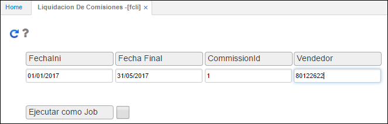

# Liquidación de Comisiones - FCLI

La opción **FCLI** permite generar un reporte por pantalla o impreso de la liquidación de las comisiones acumuladas por cada uno de los vendedores teniendo en cuenta el rango de fechas a generar las mismas, el tipo de comisión y el vendedor sobre el cual se desea ejecutar este proceso. Igualmente, permite hacer el pago de las comisiones por tesorería o por nómina.  

-	En los campos _FechaIni_ y _FechaFinal_ se debe ingresar el rango de tiempo sobre el cual se desea generar las liquidaciones.  

-	En el campo _CommissionId_ se ingresa el id del tipo de comisión que se parametrizó previamente en la opción FBPC.  

-	En el campo _Vendedor_ se diligencia el número de identificación del vendedor al cual se le generará la liquidación correspondiente.  

Posteriormente, damos click en el botón  para ejecutar el procedimiento.

Una vez ejecutado el procedimiento, ingresaremos a la aplicación [**FCOM - Comisiones**]()