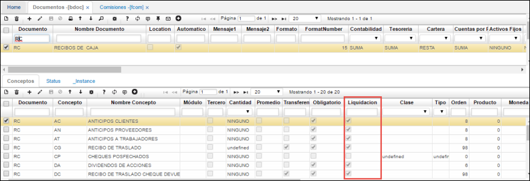

# Comisiones - FCOM

Una vez ejecutado el procedimiento en la aplicación [**FCLI - Liquidación de Comisiones**](http://docs.oasiscom.com/Operacion/scm/facturacion/fcomision/fcli), desde la opción **FCOM - Comisiones** se podrán visualizar las comisiones generadas de acuerdo a la información ingresada en el proceso especial ([**FCLI - Liquidación de Comisiones**](http://docs.oasiscom.com/Operacion/scm/facturacion/fcomision/fcli)):  

_**IMPORTANTE**_: además de lo descrito anteriormente, debe considerarse que en la aplicación [**BDOC - Documentos**](http://docs.oasiscom.com/Operacion/common/bsistema/bdoc) para el documento _RC (recibo de caja)_, el campo de _Liquidación_ en el detalle de esta aplicación debe estar activado, esto con la finalidad de que tenga en cuenta las transacciones de recibos de cajas realizadas para la generación de liquidación de comisiones que comprendan los mismos:  

De esta manera se lleva a cabo el proceso de parametrización y generación de liquidación de comisiones.  

