---

layout: default

title: Operacion

permalink: /Operacion/scm/facturacion/fcomision/

editable: si

---

# LIQUIDACIÓN DE COMISIONES

A continuación, se describirán los pasos para realizar el proceso de _Liquidación de Comisiones_:

## 1.	PARAMETRIZACIÓN DE TIPOS DE COMISIÓN.

En la opción _**FBPC**_, se realiza la parametrización de los tipos de comisión, de la siguiente manera:

_Maestro_:

-	En el campo ‘_TypeCommissionId_’ (Id Tipo Comisión), se debe ingresar el Id de la comisión (teniendo en cuenta que este es un identificador único).

-	En el campo ‘_TypeCommissionName_’ (Nombre Tipo de Comisión), se debe ingresar el nombre del tipo de comisión a crear.

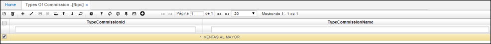

_Detalle_:

-	En el campo ‘_Clase_’, se deberá seleccionar la clase del tipo de comisión. Las principales son:

	- VENTA
	- COBRO
	- DEVOLUCIÓN

Cuando la clase corresponde a ‘_**VENTA**_’:

-	En el campo ‘_Clasificación_’, se deberá seleccionar la clasificación de productos a los que aplicará este tipo de comisión. Se debe tener en cuenta que, si este corresponde a ‘0’, aplicará para todas las clasificaciones.

-	Los campos ‘_Mínimo_’ y ‘_Máximo_’ corresponden a los rangos en precio (valor subtotal de los documentos de facturación) en los que aplicará el tipo de comisión.

-	El campo ‘_ValuePercentage_’, corresponde al porcentaje de descuento que se realizará, teniendo en cuenta el valor en ventas estipuladas en los campos ‘_Mínimo_’ y ‘_Máximo_’.

-	En el campo ‘_Marca_’, se debe seleccionar la marca del producto al que aplicará el tipo de comisión. Se debe tener en cuenta que, si este corresponde a ‘0’, aplicará para todas las marcas.

-	En el campo ‘_Línea_’, se debe seleccionar la línea a la cual aplicará el tipo de comisión. Se debe tener en cuenta que, si este corresponde a ‘0’, aplicará para todas las líneas.

-	En el campo ‘_Producto_’, se deberá seleccionar el producto al cual aplicará el tipo de comisión. Se debe tener en cuenta que, si este corresponde a ‘0’, aplicará para todos los productos.

-	El campo ‘_Nombre Producto_’, se llenará conforme a lo ingresado en el campo ‘Producto’.

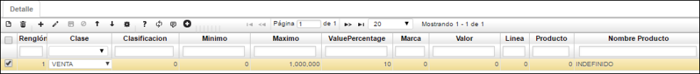

Cuando la clase corresponde a ‘_**COBRO**_’:

- En los campos ‘_Mínimo_’ y ‘_Máximo_’ se deberá ingresar el rango de días (de pago), en donde el campo mínimo puede recibir valores negativos. Teniendo en cuenta que:

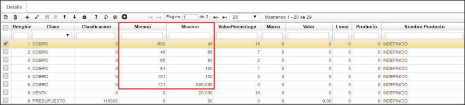

Se realizará el cobro teniendo en cuenta la _**fecha de vencimiento**_ de la opción _**CMCR**_ (Cruces), en donde el mínimo de días puede llegar a ser negativos dado que la _fecha de vencimiento_ siempre será contada en días hacia delante de la fecha del documento de ventas:

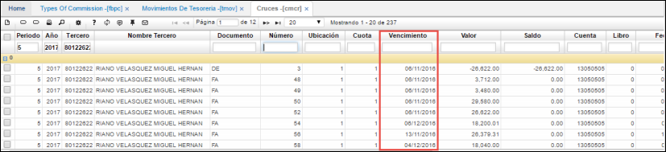

Y la _**fecha de consignación**_ de la opción _**TMOV**_ (Saldos de Tesorería) del recibo de caja que se está facturando, dado que este si se muestra en días anteriores o posteriores a la fecha del documento que se está cancelando.

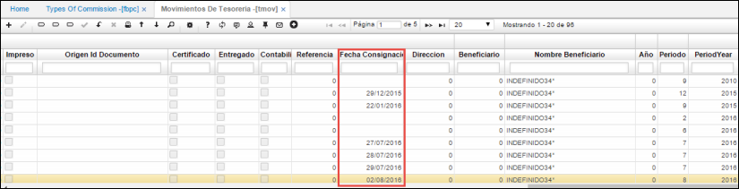

_**IMPORTANTE**_: Si este campo (Fecha de Consignación) no contiene ninguna fecha (está vacío), el sistema tomará la fecha del recibo de caja de esta misma opción:

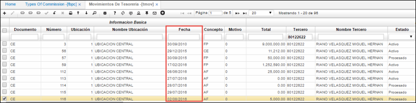

- En el campo ‘_ValuePercentage_’ se ingresará el porcentaje de descuento que se aplicará de acuerdo al rango de días ingresados en los campos ‘_Mínimo_’ y ‘_Máximo_’.

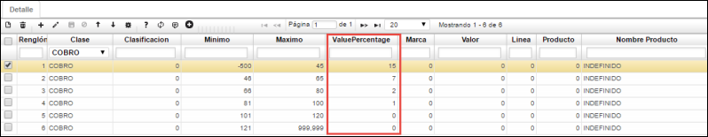

Los demás campos del detalle, se diligencian de la misma forma descrita previamente.

Cuando la clase corresponde a ‘_**DEVOLUCIÓN**_’. Cuando se realizan devoluciones de las ventas realizadas:

- En los campos ‘_Mínimo_’ y ‘_Máximo_’ se debe ingresar el rango de valor en precio (valor subtotal de los documentos de facturación) 	en caso de que se realice alguna devolución.

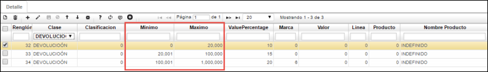

-	En el campo ‘_ValuePercentage_’ se debe ingresar el porcentaje de descuento que se aplicará en el rango establecido cuando se realice tal devolución.

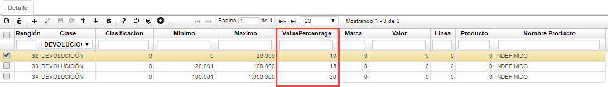

Los demás campos se diligencian de la misma manera como se explicó anteriormente.

## 2.	PARAMETRIZACIÓN DE TERCEROS

Para designar un _tipo de comisión_ a un tercero o cliente, se realiza desde la opción _**BTER**_ (Terceros):

Se consulta el tercero correspondiente y en la pestaña ‘_Ventas_’ del detalle:

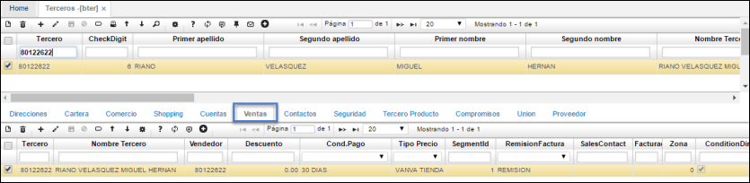

En el campo ‘_**PlanComission**_’, se deberá ingresar el Id del tipo de comisión correspondiente, los cuales fueron parametrizados en la opción _FBPC_:

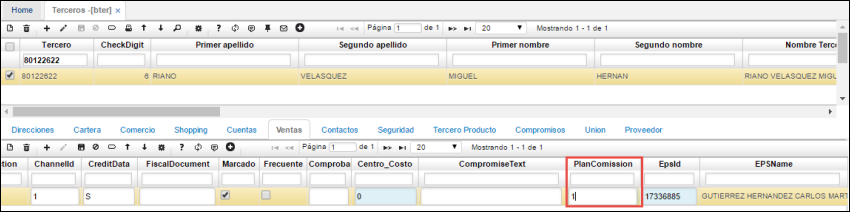

## 3.	GENERACIÓN DE LIQUIDACIÓN DE COMISIONES

Desde la opción _**FCLI**_ (Liquidación de comisiones) se realiza la ejecución del proceso especial, en donde se realiza la generación de las liquidaciones de comisiones:

-	En los campos ‘_FechaIni_’ y ‘_FechaFinal_’ se debe ingresar el rango de tiempo sobre el cual se desea generar las liquidaciones.

-	En el campo ‘_CommissionId_’ se ingresa el id del tipo de comisión que se parametrizó previamente en la opción FBPC.

-	En el campo ‘_Vendedor_’ se diligencia el número de identificación del vendedor al cual se le generará la liquidación correspondiente.

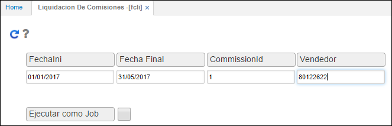

Posteriormente se selecciona el botón para ejecutar el procedimiento:

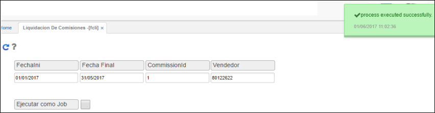

## 4.	COMISIONES GENERADAS

Una vez ejecutado el procedimiento, desde la opción _**FCOM**_ (Comisiones) se podrán visualizar las comisiones generadas de acuerdo a la información ingresada en el proceso especial (opción _FCLI_):

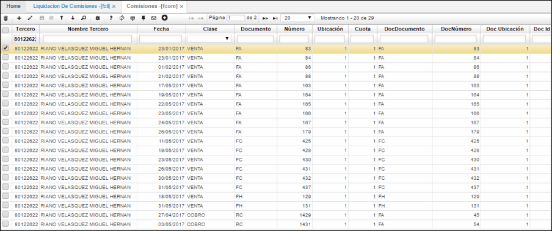

_**IMPORTANTE**_: Además de lo descrito anteriormente, debe considerarse que en la opción _**BDOC**_ (Documentos) para el documento RC (recibo de caja), el campo de ‘_Liquidación_’ en el detalle de esta opción debe estar activado, esto con la finalidad de que tenga en cuenta las transacciones de recibos de cajas realizadas para la generación de liquidación de comisiones que comprendan los mismos:

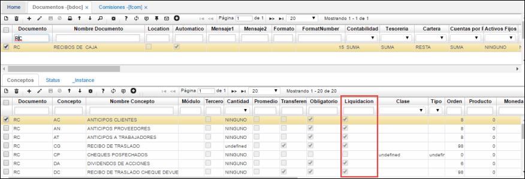

De esta manera se lleva a cabo el proceso de parametrización y generación de liquidación de comisiones.