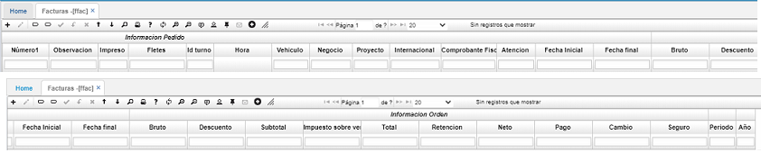
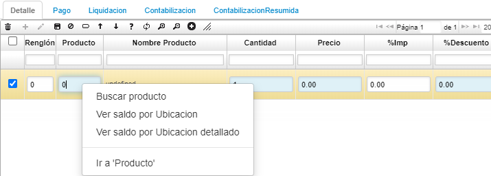
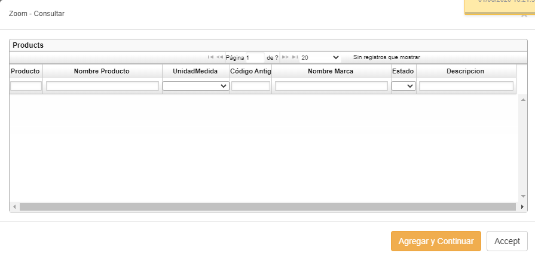
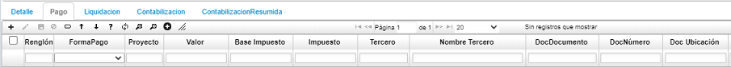
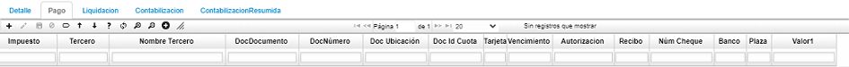
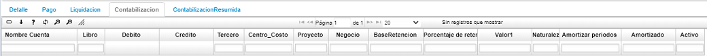
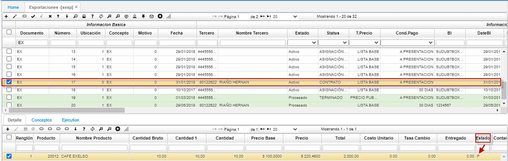
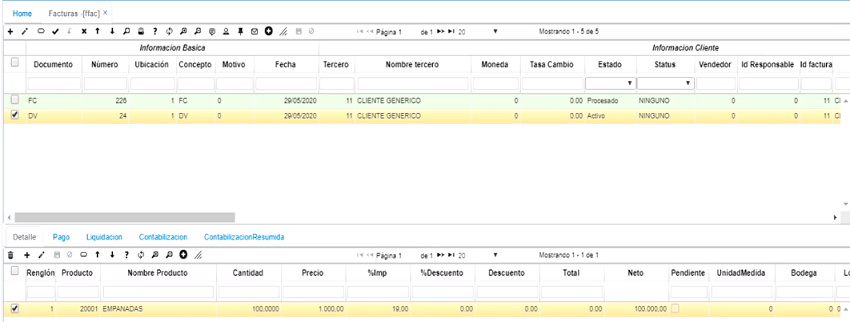
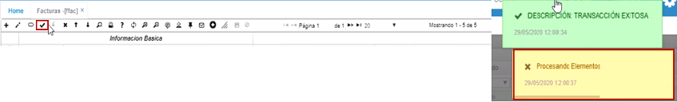

# Facturas - FFAC

La función de facturación en las empresas es uno de los ejes principales de su actividad comercial, por ello de esta aplicación y su funcionamiento depende en gran parte el desempeño de la empresa. 

>+ [Pestaña Detalle](http://docs.oasiscom.com/Operacion/scm/facturacion/ffactura/ffac#pestaña-detalle)
>+ [Pestaña Pago](http://docs.oasiscom.com/Operacion/scm/facturacion/ffactura/ffac#pestaña-pago)
>+ [Pestaña Contabilización](http://docs.oasiscom.com/Operacion/scm/facturacion/ffactura/ffac#pestaña-contabilización)  
>+ [Pestaña Contabilización Resumida](http://docs.oasiscom.com/Operacion/scm/facturacion/ffactura/ffac#pestaña-contabilización-resumida) 
>+ [Cómo realizar una factura de venta](http://docs.oasiscom.com/Operacion/scm/facturacion/ffactura/ffac#cómo-realizar-una-factura-de-venta)
>+ [Asociar Exportación](http://docs.oasiscom.com/Operacion/scm/facturacion/ffactura/ffac#asociar-exportación)
>+ [Dependencia de cuenta contable a partir de la moneda](http://docs.oasiscom.com/Operacion/scm/facturacion/ffactura/ffac#dependencia-de-cuenta-contable-a-partir-de-la-moneda)  
>+ [Devolución de Factura de Venta](http://docs.oasiscom.com/Operacion/scm/facturacion/ffactura/ffac#devolución-de-factura-de-venta)

Esta aplicación alimenta directamente las cuentas por cobrar y los saldos por cartera de los clientes, igualmente de ventas efectuadas en efectivo alimentaran directamente los saldos y movimientos de las cuentas de tesorería. La facturación se generará automáticamente al confirmar las remisiones o salidas del inventario por concepto de ventas a los clientes.

Cuando se procesa un documento de facturación de ventas y este tiene retención de ICA (RIC), el sistema llevará el dato de la ubicación geográfica a la tabla de contabilización. Se debe tener en cuenta que para esto la retención de ICA va a aplicar por dirección en el documento FC o el que corresponda para factura de venta.  

* El proceso de retenciones se realiza adicionando código de cuenta 'RFT' para acumular la retención diaria.
Esta funcionalidad permite acumular base de retencionen la fuente, para la fecha de las facturas de venta, acumulando por el dia.  

  

**Número:** Dato con el cual se conoce la factura en todo el sistema. La numeración puede ser asignada automática o manualmente.  
**Ubicación:** Número de la ubicación a la cual se va a realizar una factura.  
**Concepto:** Campo indicador del tipo de movimiento efectuado Factura de Venta (FC), Devolución (DV).  
**Fecha:** Fecha de Facturación; es muy importante puesto que es la fecha base para la generación de la cartera en caso de tener cuentas por cobrar o en caso de vender a crédito, así mismo, esta fecha es la que define a qué periodo contable corresponde la factura que estamos observando.  
**Tercero:** identificación de la persona natural o jurídica a la cual se le hizo la venta.  
**Moneda:** Tipo de moneda en la cual se está realizando esta transacción.  
**Estado:** Estado actual de la factura; con este campo vamos a controlar en qué estado se encuentra la factura para verificar si se pueden realizar cambios o modificaciones y para controlar la generación de los comprobantes de ventas correspondientes. Los estados pueden ser Activo, Procesado o Terminado.  
**Vendedor:** Nombre de la persona que realizó la venta, se utiliza este campo para la generación de las comisiones por ventas correspondientes.  
**Id Responsable:** Al realizar un cargue masivo de movimientos, podemos evidenciar que usuario cargó un archivo con el id de otro funcionario.  
  
**Dirección:** Código de la sucursal o agencia del cliente.  

  

**Tipo de Precio:** Tipo de precio con el cual se liquidó o liquidará la factura, la toma por defecto del tipo de precio definido al cliente.  
**% Descuento:** Es el porcentaje de descuento comercial que se le va a liquidar a esta factura, que afectará todos los productos de esta factura.  
**Condición Pago:** Condición de pago definida para esta factura, la toma por defecto de las condiciones definidas para el cliente o de las condiciones definidas para el pedido en caso de corresponder a un pedido. Es muy importante este campo para la generación de la Cartera puesto que con base a esto va a generar las cuotas o vencimientos de cartera correspondientes a las ventas a crédito.  
**Bodega:** Código de la bodega que hizo el despacho de los productos incluidos en la factura.  
**Documento:** Documento asociado a la factura.  
**Número:** Número del documento asociado a la factura.  
**Ubicación1:** Número de la ubicación asociada a la factura.  

**Observación:** Para el manejo de aclaraciones adicionales.  
**Comprobante Fiscal:** para las transacciones de República Dominicana, por medio de un cálculo automático se obtiene el número de comprobante fiscal. El sistema no habilitará este campo para que sea editado manualmente.  
**Bruto:** Es la sumatoria de los valores de los productos que van en la factura.  
**Descuento:** Valor total del descuento a la factura actual.  
**SubTotal:** Es el valor bruto menos el descuento.  
**Tax Sale:** Valor del impuesto aplicado a la factura.  
**Total:** Es el valor del subtotal más el valor del impuesto.  
**Retención:** Porcentaje de retención establecido para los productos multiplicado por el subtotal, en caso de tenerse retención por venta a un agente retenedor.  
**Neto:** Es el total menos la retención, en caso de que el comprador de la mercancía sea un agente retenedor.  
**Impreso:** Check que indica si la factura ya fue impresa.  
**Proyecto:** número de proyecto al cual va asignada la factura.  

## [Pestaña Detalle](http://docs.oasiscom.com/Operacion/scm/facturacion/ffactura/ffac#pestaña-detalle)

Listado de productos facturados con sus cantidades y precios. Totales en cantidades y costo total de la mercancía.  

**Renglón:** Número que identifica cada fila o registro del detalle. No pueden existir dos números de renglón repetidos.  
**Producto:** Código y nombre del producto asignado en **BPRO**.  
**Cantidad:** Cantidad del producto que se factura.  
**Precio:** Precio correspondiente a la lista de precios definida para el cliente.  
**% Impuesto:** Valor porcentual del impuesto cobrado al cliente por el pedido.  
**% Descuento:** Valor porcentual del descuento dado al cliente, corresponde al ingresado en el pedido.  
**Descuento:** Valor en cifras del descuento dado al cliente.  
**Total:** Valor total del producto facturado.  
**Unidad medida:** Unidad de medida del producto.  
**Bodega:** Código de la bodega que hizo el despacho de los productos incluidos en la factura.  

  

Se adecua la funcionalidad de facturación en bloque, esto se verá reflejado al asociar los TI X DS en el detalle del FFAC por medio del zoom de bodega “Facturación x Bloque”.  

  
zoom.
  

**Localización:** Código de la localización (sección de la bodega) donde estaban ubicados los productos.  
**Característica:** Código de la característica que se puede atribuir al producto si aplica.  
**Presentación:** Forma de presentación del producto.  
**Vencimiento:** Fecha de vencimiento del producto, en caso de ser perecedero y que es ingresado en el momento del ingreso de la mercancía.  
**Control:** Número de serial o consecutivo asignado a productos que vende la empresa y poder así identificarlos y llevar un control sobre ellos y que es ingresado en la entrada de producción (Si Aplica).  
**Remisión:** Número de la remisión (documento de salida del inventario en la bodega) El sistema permite incluir en una misma factura varias remisiones, para ello el cliente en **BTER** (Aplicación de registro de terceros) debe estar deshabilitado el indicador de factura por Remisión.  
**Pedido:** Compuesto por dos campos donde indica la ubicación y número del pedido que origino la transacción.  
**Proyecto:** Parametrizacion que se realiza en basico de proyectos **[BPRY]**.  

Al final del detalle se totaliza las cantidades y valor bruto de los productos facturados, estos valores son calculados a medida que se incluyen nuevos renglones o productos.  

La opción importar archivo facilita la digitación de los productos y cantidades que componen el detalle mediante la importación (traída) o lectura de un archivo en Excel que los contenga.  

**Saldos:**  
clic derecho sobre el campo producto,  aparece la siguiente ventana:  

  

posterior abre el siguiente zoom de seleccion:  

  

* Botón **Agregar y Continuar**, para reanudar la inserción de documentos.  
* Botón **Aceptar** para insertar los ítems seleccionados y cierra el zoom de búsqueda.  

## [Pestaña Pago](http://docs.oasiscom.com/Operacion/scm/facturacion/ffactura/ffac#pestaña-pago)

Registro de la forma de pago de dicha factura, en las ventas a crédito estos datos son diligenciados automáticamente. Esta pestaña es de vital importancia para facturas con pago de contado para el registro de la cantidad en efectivo y / o cheque(s) con la cual se cancela la factura, el sistema se acomoda a las últimas disposiciones legales de pago con tarjeta de crédito donde se debe indicar el monto de IVA que causan los productos facturados.

**Ubicación:** Ubicación desde la cual se factura el producto.  
**Renglón:** Consecutivo de formas de pago.  
**Forma de pago:** Identificación de la forma de pago.  
**Valor:** Monto valor cancelado en la respectiva forma de pago.  
**Base impuesto:** Valor sobre el cual se calculó el impuesto.  
**Impuesto:** Valor del impuesto.  
**Tercero:** Identificación y nombre del tercero al cual se factura.  
**Doc Documento:** permite seleccionar del zoom multiples documentos con los que se requiera hacer cruces con la factura.  
**Doc Número:** Número del documento relacionado con la factura.  
**Doc Ubicación:** Ubicación del documento relacionado con la factura.  

**Tarjeta:** Tarjeta con la cual se realizó el pago, en caso tal que haya sido con tarjeta.  
**Vencimiento:** Fecha de vencimiento del pago.  
**Banco:** Banco por el cual se realizó el pago.  
**Plaza:** Ciudad o lugar desde donde se realizó el pago.  

**Tarjeta de crédito (Sección)**

**IVA:** Monto correspondiente de IVA de los productos facturados.  
**Número:** Se deben digitar los 16 números de la tarjeta de crédito.  
**Vencimiento:** Fecha de vigencia de la Tarjeta.  
**Autorización:** Número de autorización suministrado por el sistema de validación y compra (Datafono).  

**Cheque (Sección)**

**Número:** Número del cheque.  
**Banco:** Código del Banco (Número de compensación).  
**Plaza:** Ciudad de radicación de la cuenta corriente del cheque.  

## [Pestaña Contabilización](http://docs.oasiscom.com/Operacion/scm/facturacion/ffactura/ffac#pestaña-contabilización)

La pestaña de Contabilización permite visualizar la contabilización que realiza el sistema automáticamente.  

**Cuenta:** Número de cuenta contable afectada.  
**Nombre cuenta:** Nombre de la cuenta contable afectada.  
**Libro:** Número del libro en el cual se realizó la contabilización.  
**Débito:** Valores correspondientes a cuentas de naturaleza débito.  
**Crédito:** Valores correspondientes a cuentas de naturaleza crédito.  
**Tercero:** Identificación del tercero al cual afecta la contabilización.  
**Centro costo:** Centro de costo al cual afecta el movimiento.  
**Proyecto:** Número de proyecto asociado.  

**Negocio:** Número de negocio asociado.  
**Base retención:** Valor base sobre el cual se realizó la retención.  
**Porcentaje de retención:** Valor porcentual de retención realizada.  
**Naturaleza:** Naturaleza de la cuenta contable.  
**Amortizar periodos:** Cantidad de periodos de amortización.  
**Amortizado:** Valor amortizado.  

## [Pestaña Contabilización Resumida](http://docs.oasiscom.com/Operacion/scm/facturacion/ffactura/ffac#pestaña-contabilización-resumida)  

Se crea la pestaña “contabilización resumida” donde se **totalizan** los valores de las cuentas parametrizadas.  

  

## [Cómo realizar una factura de venta](http://docs.oasiscom.com/Operacion/scm/facturacion/ffactura/ffac#cómo-realizar-una-factura-de-venta)  

Se ingresa a la aplicación y se adiciona un nuevo registro (+).  En el campo **_Documento_** se selecciona a través del Zoom la opción **_FC_** que se refiere a Factura de Venta, en el campo **_Concepto_** se selecciona también **_FC_** Factura Cliente que hacen referencia a lo mismo, en el campo **_Motivo_** se escribe Cero (0), en el campo **_tercero_**, se diligencia el documento de la persona a quien se realiza la venta, el cual ya debe estar parametrizado en la aplicación **Terceros - BTER**, en el campo **_Condición de pago_** se encuentra una lista desplegable con las diferentes condiciones de pago; estas deben estar parametrizadas con anterioridad en la aplicación **Condiciones de pago - BCND**.  A continuación, aparece otro campo llamado **_TipoPrecio_** también con una lista desplegable, este campo funciona igual que el anterior y debe estar previamente parmetrizado en la aplicación **Tipos de precio - FBTP**.  Diligenciado por completo el registro, se guarda.  

Ahora, se crea el detalle.  Se agrega un nuevo registro (+).  En el campo **_Producto_** se abre el zoom y se elige el producto que se va a vender (producto que ya debe estar parametrizado en la aplicación **Productos - BPRO**, al dar tab, el sistema trae automáticamente el nombre del producto, en el campo **_Cantidad_** se diligencia la cantidad que se va a vender, en el campo **_Precio_**, el precio (que ya debe estar parametrizado en la aplicación **Precios - FPRE**, se guarda el registro.  Ahora se procesa la factura de venta.  Los campos **_Impuesto_** (se diligencia de acuerdo con la parametrzación en **Productos - BPRO** y **_Total_** se diligencian automáticamente.  

  

  

Luego, se ingresa a la aplicación **Consulta de facturas - FFCF** para consultar la factura realizada anteriormente con el mismo número y Documento de la factura.

  

Finalmente se verifica la salida del producto que se está facturando.  Esto se hace ingresando a la aplicación **Kárdex por Ubicación - ICKU**.  Aquí, se consulta por el número de consecutivo del producto.

  

## [Asociar Exportación](http://docs.oasiscom.com/Operacion/scm/facturacion/ffactura/ffac#asociar-exportación)

Este proceso permite enlazar en la opción **FFAC** los documentos de las exportaciones _XEXP_ para así poder terminar con el ciclo de la exportación.  

Cuando se tiene un documento _EX - Exportaciones_ en estado _Procesado_ o _Activo_, y algún renglón en el detalle está procesado, se podrá asociar dicho documento **EX** a un documento **FA** en la aplicación FFAC para así ser facturado.  

Documento EX en estado Activo con renglón en el detalle Procesado.  

Es posible asociar varias exportaciones en una sola factura, para ello inicialmente debemos asociar un documento de una exportación en el maestro y las demás las relacionaremos en el detalle.  

Para asociar la exportación en el maestro de la factura, ingresamos el documento, el número de consecutivo y la ubicación.  

En el detalle, agregamos un nuevo renglón e ingresamos el producto de la factura para posteriormente validar el zoom de exportaciones pendientes.  

En el campo _Id Orden_ damos click derecho e ingresamos en la opción _**Exportaciones pendientes**_.  

Seleccionamos del zoom las exportaciones que deseamos relacionar en la factura.  

Las exportaciones se reflejarán en el detalle de la factura.  

En los campos Doc Documento1, se mostrará el número del documento EX asociado.  

Al procesar la factura, se podrá visualizar la actualización de las exportaciones en el renglón del detalle facturado en el campo **Entregado** con la cantidad inicialmente designada al producto y debe también actualizar el estado de los mismos a terminado (letra **T**).  

## [Dependencia de cuenta contable a partir de la moneda](http://docs.oasiscom.com/Operacion/scm/facturacion/ffactura/ffac#dependencia-de-cuenta-contable-a-partir-de-la-moneda)

Al generar una factura de venta se debe asignar una moneda con la cual se realizará la transacción. A dicha moneda, es posible parametrizarle el grupo de cuentas contables de las cuales dependerá. Las monedas se parametrizan en la aplicación [**BMON - Monedas**](http://docs.oasiscom.com/Operacion/common/bfinan/bmon).  

En el siguiente ejemplo crearemos una factura de venta con moneda 0 correspondiente a pesos colombianos. El campo _Moneda_ tiene un zoom que nos permite ver las monedas y seleccionar la necesaria.  

Zoom moneda  

Para consultar el grupo de cuentas contables de las cuales depende la moneda 0, ingresamos a la aplicación [**BMON - Monedas**](http://docs.oasiscom.com/Operacion/common/bfinan/bmon) y consultamos por moneda 0.  

Podemos ver que la moneda 0 tiene asignado el grupo de cuentas 0. A continuación, para conocer las cuentas contables que tiene asociadas este grupo ingresamos a la opción [**BGRU - Grupos**](http://docs.oasiscom.com/Operacion/common/bcuenta/bgru) y consultamos por el grupo 0. En el detalle, consultaremos por el código _CXC_ correspondiente a cuentas por cobrar y allí veremos la cuenta contable de la cual depende la moneda 0.  

Este proceso también aplica para las facturas por compras, en donde el código de consulta será _CXP_ correspondiente a cuentas por pagar.  

  

## [Devolución de Factura de Venta](http://docs.oasiscom.com/Operacion/scm/facturacion/ffactura/ffac#devolución-de-factura-de-venta)   

Para realizar el proceso de Devolución de una Factura de Venta, primero se realiza la factura de Venta como ya se había indicado con **_Documento: FC_**, **_Ubicación: 1_**, **_Concepto: FC_**, relacionando también **_Cliente_**, **_Condición de Pago_** y demás características ya explicadas arriba para este documento. Se guarda el maestro y en el detalle, se relaciona el producto digitando el código si se conoce, o dando click derecho y eligiendo la opción _Ver Saldo por Ubicación_ y en este Zoom se filtran todos los productos que se necesiten y que tengan cantidad disponible para facturar, se adiciona el registro y aparece la cantidad correcta en el detalle.  Luego, se procesa el documento.  La devolución se realiza a través de esta misma aplicación pero con **_Documento_** y **_Concepto_** diferentes.  Se debe tener en cuenta el número de la factura y la Ubicación.  

  

Se adiciona un nuevo registro (+) y en el campo **_Documento_**, se coloca la opción **_DV_** de Devolución Venta, en el campo **_Ubicación_** se coloca la misma ubicación de la factura a la que le vamos a realizar la devolución, en el campo **_Concepto_** también se coloca **_DV_** de Devoluciones, en el campo **_Tercero_** el mismo cliente de la factura de la que se va a realizar la devolución:  

  

En la parte inferior, en los campos **_Documento1_**, **_Ubicación1_** y **_Número1_**, se relaciona la factura a la que se le va a realizar la nota crédito o devolución.  En **_Documento1: FC_**, **_Ubicación1: 1_**, en **_Número1_** se escribe el número de la factura sin espacios o darle click en el Zoom y buscarla y se guarda el registro.  

En la pantalla ya aparece el registro de la factura y el de la devolución con el mismo detalle de la factura:  

  

En el campo **_Cantidad_** del detalle se selecciona si se va a realizar la devolución por todas las unidades facturadas o por menor cantidad:  

  

Para este ejemplo, se hace por la misma cantidad facturada.  Se guarda el registro del detalle y enseguida se procesa.  

  

  

Posteriormente, se puede validar en la aplicación **Saldos por Localización - ISPL** o algún reporte que muestre los _Saldos de Inventario_, si efectivamente la devolución quedó correcta.  Ingresamos a la aplicación **ISPL**, colocamos los datos de **_Periodo_**, **_Producto_** y **_Ubicación_** y nos muestra las _Entradas_, _Salidas_ y el _Saldo en Cantidad de Unidades_. 

