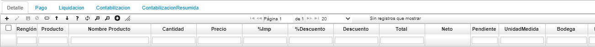

# Facturas - FFAC

La función de facturación en las empresas es uno de los ejes principales de su actividad comercial, por ello de esta aplicación y su funcionamiento depende en gran parte el desempeño de la empresa. Esta aplicación alimenta directamente las cuentas por cobrar y los saldos por cartera de los clientes, igualmente de ventas efectuadas en efectivo alimentaran directamente los saldos y movimientos de las cuentas de tesorería. La facturación se generará automáticamente al confirmar las remisiones o salidas del inventario por concepto de ventas a los clientes.

**Número:** Dato con el cual se conoce la factura en todo el sistema. La numeración puede ser asignada automática o manualmente.  
**Ubicación:** Número de la ubicación a la cual se va a realizar una factura.  
**Concepto:** Campo indicador del tipo de movimiento efectuado Factura de Venta (FC), Devolución (DV).  
**Fecha:** Fecha de Facturación; es muy importante puesto que es la fecha base para la generación de la cartera en caso de tener cuentas por cobrar o en caso de vender a crédito, así mismo, esta fecha es la que define a qué periodo contable corresponde la factura que estamos observando.  
**Tercero:** identificación de la persona natural o jurídica a la cual se le hizo la venta.  
**Moneda:** Tipo de moneda en la cual se está realizando esta transacción.  
**Estado:** Estado actual de la factura; con este campo vamos a controlar en qué estado se encuentra la factura para verificar si se pueden realizar cambios o modificaciones y para controlar la generación de los comprobantes de ventas correspondientes. Los estados pueden ser Activo, Procesado o Terminado.  
**Vendedor:** Nombre de la persona que realizó la venta, se utiliza este campo para la generación de las comisiones por ventas correspondientes.  
**Dirección:** Código de la sucursal o agencia del cliente.  

**Tipo de Precio:** Tipo de precio con el cual se liquidó o liquidará la factura, la toma por defecto del tipo de precio definido al cliente.  
**% Descuento:** Es el porcentaje de descuento comercial que se le va a liquidar a esta factura, que afectará todos los productos de esta factura.  
**Condición Pago:** Condición de pago definida para esta factura, la toma por defecto de las condiciones definidas para el cliente o de las condiciones definidas para el pedido en caso de corresponder a un pedido. Es muy importante este campo para la generación de la Cartera puesto que con base a esto va a generar las cuotas o vencimientos de cartera correspondientes a las ventas a crédito.  
**Bodega:** Código de la bodega que hizo el despacho de los productos incluidos en la factura.  
**Documento:** Documento asociado a la factura.  
**Número:** Número del documento asociado a la factura.  
**Ubicación1:** Número de la ubicación asociada a la factura.  

**Observación:** Para el manejo de aclaraciones adicionales.  
**Bruto:** Es la sumatoria de los valores de los productos que van en la factura.  
**Descuento:** Valor total del descuento a la factura actual.  
**SubTotal:** Es el valor bruto menos el descuento.  
**Tax Sale:** Valor del impuesto aplicado a la factura.  
**Total:** Es el valor del subtotal más el valor del impuesto.  
**Retención:** Porcentaje de retención establecido para los productos multiplicado por el subtotal, en caso de tenerse retención por venta a un agente retenedor.  
**Neto:** Es el total menos la retención, en caso de que el comprador de la mercancía sea un agente retenedor.  
**Impreso:** Check que indica si la factura ya fue impresa.  
**Proyecto:** número de proyecto al cual va asignada la factura.  

Pestaña Detalle

Listado de productos facturados con sus cantidades y precios. Totales en cantidades y costo total de la mercancía.  

**Renglón:** Número que identifica cada fila o registro del detalle. No pueden existir dos números de renglón repetidos.  
**Producto:** Código y nombre del producto asignado en **BPRO**.  
**Cantidad:** Cantidad del producto que se factura.  
**Precio:** Precio correspondiente a la lista de precios definida para el cliente.  
**% Impuesto:** Valor porcentual del impuesto cobrado al cliente por el pedido.  
**% Descuento:** Valor porcentual del descuento dado al cliente, corresponde al ingresado en el pedido.  
**Descuento:** Valor en cifras del descuento dado al cliente.  
**Total:** Valor total del producto facturado.  
**Unidad medida:** Unidad de medida del producto.  
**Bodega:** Código de la bodega que hizo el despacho de los productos incluidos en la factura.  

**Localización:** Código de la localización (sección de la bodega) donde estaban ubicados los productos.  
**Característica:** Código de la característica que se puede atribuir al producto si aplica.  
**Presentación:** Forma de presentación del producto.  
**Vencimiento:** Fecha de vencimiento del producto, en caso de ser perecedero y que es ingresado en el momento del ingreso de la mercancía.  
**Control:** Número de serial o consecutivo asignado a productos que vende la empresa y poder así identificarlos y llevar un control sobre ellos y que es ingresado en la entrada de producción (Si Aplica).  
**Remisión:** Número de la remisión (documento de salida del inventario en la bodega) El sistema permite incluir en una misma factura varias remisiones, para ello el cliente en **BTER** (Aplicación de registro de terceros) debe estar deshabilitado el indicador de factura por Remisión.  
**Pedido:** Compuesto por dos campos donde indica la ubicación y número del pedido que origino la transacción.  

Al final del detalle se totaliza las cantidades y valor bruto de los productos facturados, estos valores son calculados a medida que se incluyen nuevos renglones o productos.

La opción importar archivo facilita la digitación de los productos y cantidades que componen el detalle mediante la importación (traída) o lectura de un archivo en Excel que los contenga.

Pestaña Pago

Registro de la forma de pago de dicha factura, en las ventas a crédito estos datos son diligenciados automáticamente. Esta pestaña es de vital importancia para facturas con pago de contado para el registro de la cantidad en efectivo y / o cheque(s) con la cual se cancela la factura, el sistema se acomoda a las últimas disposiciones legales de pago con tarjeta de crédito donde se debe indicar el monto de IVA que causan los productos facturados.

**Ubicación:** Ubicación desde la cual se factura el producto.  
**Renglón:** Consecutivo de formas de pago.  
**Forma de pago:** Identificación de la forma de pago.  
**Valor:** Monto valor cancelado en la respectiva forma de pago.  
**Base impuesto:** Valor sobre el cual se calculó el impuesto.  
**Impuesto:** Valor del impuesto.  
**Tercero:** Identificación y nombre del tercero al cual se factura.  
**Documento:** Tipo de documento relacionado con la factura.  
**Número:** Número del documento relacionado con la factura.  
**Ubicación:** Ubicación del documento relacionado con la factura.  

**Tarjeta:** Tarjeta con la cual se realizó el pago, en caso tal que haya sido con tarjeta.
**Vencimiento:** Fecha de vencimiento del pago.
**Banco:** Banco por el cual se realizó el pago.
**Plaza:** Ciudad o lugar desde donde se realizó el pago.

**Tarjeta de crédito (Sección)**

**IVA:** Monto correspondiente de IVA de los productos facturados.  
**Número:** Se deben digitar los 16 números de la tarjeta de crédito.  
**Vencimiento:** Fecha de vigencia de la Tarjeta.  
**Autorización:** Número de autorización suministrado por el sistema de validación y compra (Datafono).  

**Cheque (Sección)**

**Número:** Número del cheque.  
**Banco:** Código del Banco (Número de compensación).  
**Plaza:** Ciudad de radicación de la cuenta corriente del cheque.  

Pestaña Contabilización

La pestaña de Contabilización permite visualizar la contabilización que realiza el sistema automáticamente.  

**Cuenta:** Número de cuenta contable afectada.  
**Nombre cuenta:** Nombre de la cuenta contable afectada.  
**Libro:** Número del libro en el cual se realizó la contabilización.  
**Débito:** Valores correspondientes a cuentas de naturaleza débito.  
**Crédito:** Valores correspondientes a cuentas de naturaleza crédito.  
**Tercero:** Identificación del tercero al cual afecta la contabilización.  
**Centro costo:** Centro de costo al cual afecta el movimiento.  
**Proyecto:** Número de proyecto asociado.  

**Negocio:** Número de negocio asociado.  
**Base retención:** Valor base sobre el cual se realizó la retención.  
**Porcentaje de retención:** Valor porcentual de retención realizada.  
**Naturaleza:** Naturaleza de la cuenta contable.  
**Amortizar periodos:** Cantidad de periodos de amortización.  
**Amortizado:** Valor amortizado.  

