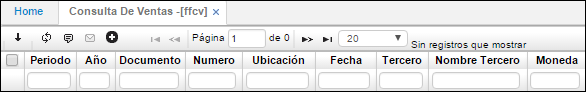
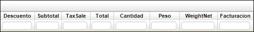

# Consulta de Ventas - FFCV

Resumen que permite visualizar los movimientos efectuados por la facturación y que permite efectuar consultas por algunos datos específicos mostrando los datos totales de la consulta.

**Periodo:** Hace referencia al mes en que se realizó la venta.  
**Año:** Año en el que se realizó la venta.  
**Documento:** Tipo de transacción FC Factura de Venta o DV Devolución.  
**Número:** Número de la transacción o movimiento.  
**Ubicación:** Ubicación o dependencia que realizó la factura o transacción.  
**Fecha:** Fecha de realización.  
**Tercero:** Código y nombre del Cliente.  
**Moneda:** Tipo de moneda en la cual se registró la factura y se realizó a venta.  

**Descuento:** Monto de los descuentos.  
**Impuesto:** Monto del Impuesto IVA.  
**Total:** Valor Total de la factura (Subtotal + IVA).  
**Cantidad:** Número de unidades facturas de determinado producto.  
**Peso:** Peso que tiene la mercancía facturada.  
**Val/Peso:** Valor por cada unidad de peso de los productos facturados.  

