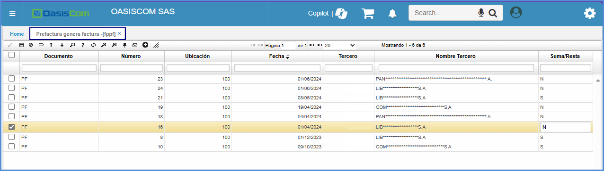
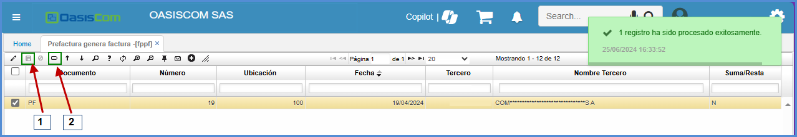

# FPPF - Prefactura genera factura  

La aplicación **FPPF - Prefactura Genera Factura** tiene como fnción.......

Para este escenario, se crea una cita en la aplicación [**GCAL - Calendario**](https://docs.oasiscom.com/Operacion/is/hospital/gcita/gcal). 

Una vez validado este proceso de la creación de la cita, se visualiza el registro en la aplicación [**GCON - Consultas**](https://docs.oasiscom.com/Operacion/is/hospital/gconsulta/gcon) y se procesa el registro.

Una vez procesado el registro, el sistema creara un registro en la aplicación **FPPF - Prefactura Genera Factura** 

Una vez que se haya **procesado** el registro en la aplicación [**GCON - Consultas**](https://docs.oasiscom.com/Operacion/is/hospital/gconsulta/gcon) se acomulan los registros en la aplicación **FPPF - Prefactura Genera Factura** y esto se puede validar en la aplicación [**FFAC - Facturas**](https://docs.oasiscom.com/Operacion/scm/facturacion/ffactura/ffac) 

>**Nota:** Esta aplicación para las **IPS** solo es para validación de las **Pre-Facturas**.

En el Campo Suma/Resta, en la aplicación **FPPF - Prefactura Genera Factura** se encuentran dos letras **S** y **N**. Lo cual la letra **S** es de Suma y la letra **N** es de Resta**.

Una vez asignado la letra, se ejecuta el botón **Guardar** 

Al momento de generar, el sistema crea la factura en la aplicación [**GFAC - Facturas**](https://docs.oasiscom.com/Operacion/is/hospital/gfacturacion/gfac). 

Hecho este proceso, se ingresa a la aplicación [**FFAC - Facturas**](https://docs.oasiscom.com/Operacion/scm/facturacion/ffactura/ffac) para validar que el estado del registro haya cambiado a **Terminado** 

En la aplicación [**GFAC - Facturas**](https://docs.oasiscom.com/Operacion/is/hospital/gfacturacion/gfac) se relaciona la Pre-factura.

>**Importante:** Si alguna consulta no se encuentra en la aplicación [**GFAC - Facturas**](https://docs.oasiscom.com/Operacion/is/hospital/gfacturacion/gfac) es porque no se ejecuto el botón de **Crear Consulta**. Si se requiere ingresar la información Manual, se puede realizar. Sin embargo, cuando se procese, el sistema compara el registro de la Pre-Factura con la factura que se encuentra en la aplicación [**FFAC - Facturas**](https://docs.oasiscom.com/Operacion/scm/facturacion/ffactura/ffac). 

