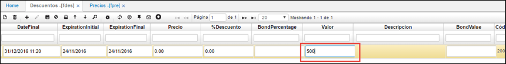
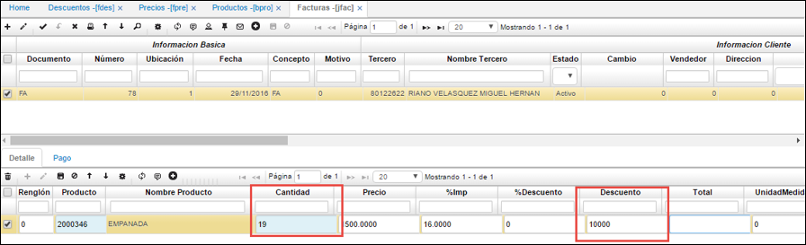
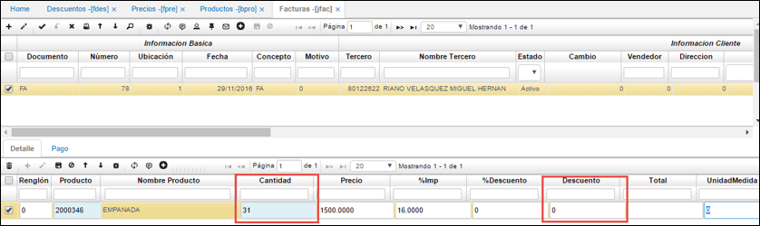
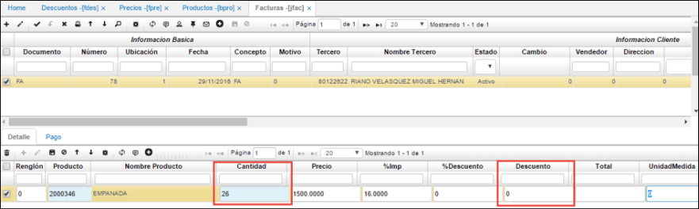

# Descuentos - FDES

Permite registrar los descuentos comerciales establecidos con los clientes.

**Id descuento:** consecutivo de la aplicación Descuentos.  
**Ubicación:** número de la ubicación de la empresa a la cual se va a agregar el descuento.  
**Tipo precio:** seleccionar tipo de precio correspondiente al tercero.  
**Tercero:** número de identificación del tercero al que se asigna el descuento.  
**Nombre tercero:** nombre del tercero al que se asigna el descuento.  
**Clasificación:** número de clasificación del producto al cual se le realizará descuento.  
**Nombre clasificación:** nombre de clasificación del producto.  
**Producto:** número asignado al producto previamente en la aplicación BPRO Productos.  

**Nombre producto:** nombre del producto al cual se realizará descuento.  
**Fecha inicial:** fecha inicial del descuento.  
**Fecha final:** fecha final del descuento.  
**Tipo descuento:** seleccionar el tipo de descuento que se va aplicar.  
**Precio:** precio del producto.  
**% descuento:** porcentaje de descuento que se va aplicar al producto.  
**CodeExternal:**  relaciona códigos adicionales para la generación de información posterior.  

Desde **FDES** se parametrizan tipos de descuentos, aplica ingresando en el maestro el producto, rango de fecha inicial y final donde en el detalle inserta el tope en cantidad y el precio que debe de aplicar para facturas en: JFAC, FFAC y VPED.

## [Parametrización liquidación por Vencimiento](http://docs.oasiscom.com/Operacion/scm/facturacion/fprecio/fdes#parametrización-liquidación-por-vencimiento)

Para hacer uso de la funcionalidad de descuentos para productos con fecha de vencimiento, se debe tener presente la siguiente configuracion en FDES.  

Se deben configurar aparte de las fechas de vigencia y tipo de descuento el rango de fechas de vencimiento que aplican para ese descuento.  

Con esta configuración según el rango de fechas de vencimiento el sistema tomará los descuentos correspondientes. Validamos lo anterior en la aplicación [**JFAC - Facturas**](http://docs.oasiscom.com/Operacion/scm/pos/jcajero/jfac#liquidación-por-vencimiento).

## [Motor de Promociones](http://docs.oasiscom.com/Operacion/scm/facturacion/fprecio/fdes#motor-de-promociones)

Este proceso consiste en la parametrización de tipos de descuentos que pueden ser aplicados a productos al momento de realizar algún movimiento en OasisCom. Los tipos de descuentos son los siguientes:  

* **Descuento en Valor:** es el descuento que se realiza al precio de un producto conforme a un valor determinado. _Por ejemplo:_  

  Sea un producto ‘X’ con precio $50.000, se realiza un descuento por valor de $10.000 sobre el precio del mismo, es decir, este producto queda a la venta con un precio de $40.000.  

* **Descuento por Precio:** consiste en el descuento que se realiza a un producto reduciendo el precio original del mismo. _Por ejemplo:_  

  Sea un producto ‘X’ con precio $30.000, desea dejarse para la venta a un descuento por precio de $20.000.  
  
* **Descuento por %:** consiste en el descuento que se realiza a nivel porcentual, descontando el porcentaje determinado al precio original del producto. _Por ejemplo:_  

  Sea un producto ‘X’ con precio $50.000 se deja a la venta con un descuento del 10%, es decir $45.000.  
 
 
* **Descuento por volumen en %:** este descuento consiste en la reducción porcentual del precio de un producto a los compradores que adquieren grandes cantidades del producto en cuestión. _Por ejemplo:_  
 
  Sea un producto ‘X’ con precio $10.000, si adquiere entre 5 y 15 unidades del mismo, se le hará un descuento del 20% sobre el valor total, es decir, si el comprador adquiere 10 unidades ($100.000) el 20% de descuento sobre este valor será $80.000.

* **Descuento por volumen en Valor:** este descuento (al igual que el descuento en valor) se realiza al precio de un producto de acuerdo con un valor estipulado, la diferencia radica en que este descuento es aplicado a compradores que adquieren grandes cantidades del producto en cuestión. _Por ejemplo:_  

  Sea un producto ‘X’ con precio $10.000, si el comprador adquiere entre 5 y 10 unidades del mismo, se le hará un descuento por valor de $20.000 pesos, es decir, si compra 10 unidades, su descuento será de $80.000.

* **Descuento en % con Control de Cantidad:** consiste a la aplicación de descuento porcentual sobre el precio de un producto para aquellos compradores que adquieran grandes cantidades. Este descuento únicamente será aplicable cuando el cliente lleve un acumulado determinado de unidades del producto (Tope). _Por ejemplo:_  

  Se aplica un porcentaje del 10% a aquel comprador que adquiera hasta 30 unidades del producto, sin pasarse de esta cantidad.

La parametrización de los tipos de descuento descrita se definirá a continuación:  

* Se debe realizar la creación de los tipos de descuentos en la aplicación [**FBTD - Tipos de Descuento**](http://docs.oasiscom.com/Operacion/scm/facturacion/fbasica/fbtd). (_Ver aplicación_) 
* Se deben crear los productos en la aplicación [**BPRO - Productos**](http://docs.oasiscom.com/Operacion/common/bprodu/bpro) y la lista de precios correspondiente en la opción [**FPRE - Precios**](http://docs.oasiscom.com/Operacion/scm/facturacion/fprecio/fpre). (_Ver aplicación_)  

Ahora, en la aplicación **FDES - Descuentos** se realiza la parametrización de los tipos de descuentos descritos anteriormente, así:  

## [Descuento en Valor](http://docs.oasiscom.com/Operacion/scm/facturacion/fprecio/fdes#descuento-en-valor)

Agregamos un nuevo registro y diligenciamos lo siguiente:  

**Descuento Id:** se ingresa el Id del descuento. Se debe tener en cuenta que este Id no es un consecutivo, pero si debe ser un número exclusivo para cada registro.  
**Nombre Descuento:** se debe ingresar el nombre del descuento. En este caso _Descuento en Valor_.  

**Ubicación:** se ingresa la ubicación en donde aplicará este descuento. Se debe tener en cuenta que, si se deja en ubicación **0**, esto quiere decir que este descuento aplicará para todas las ubicaciones.  

**T. Precio:** se debe diligenciar el tipo de precio que aplicará este descuento. Estos tipos de precio son una clasificación de los precios que pueden aplicar en las empresas.  

**Tipo Descuento:** se selecciona el tipo de descuento, teniendo en cuenta que el tipo de descuento a seleccionar debe concordar con la parametrización que desea realizarse. En este caso, por ejemplo, si el descuento es _Descuento en valor_, el tipo de descuento debe ser _Descuento en Valor_.  

**Tercero:** se ingresa el usuario al que aplicará este descuento. Se debe tener en cuenta que, si el tercero es **0**, quiere decir que esta parametrización aplica para todos los terceros.  

**Segment Id:** se selecciona el segmento al que pertenece el cliente seleccionado, es decir, hace referencia a una manera de clasificación de clientes.  

**Clasificación:** se diligencia el tipo de producto seleccionado.  

**Marca:** Se diligencia la marca del producto en cuestión para el que aplicará el descuento, teniendo en cuenta que, si se diligencia **0**, quiere decir que este descuento aplica para todas las marcas del mismo.  

**Línea:** se selecciona la línea del producto. Por ejemplo, si el producto corresponde a una camisa, este puede tener línea masculina, línea femenina, línea infantil, etc. Debe tenerse en cuenta que si la línea es **0** aplicará para todas las líneas.  

**Producto:** se debe ingresar el código del producto sobre el cual aplicará el descuento parametrizado, aquí pues se ingresa uno de los productos parametrizados anteriormente. Se debe tener en cuenta que, si el código del producto es **0**, quiere decir que aplica para todos los productos.  

En los campos **FechaIni** y **DateFinal** se debe ingresar la vigencia del descuento, es decir, de cuando a cuando esta parametrización será aplicable.  

El llenado de los campos **Precio**, **%Descuento**, y **Valor** dependen del descuento que se esté parametrizando. En este caso para el descuento por valor se diligencia el campo **Valor**.  

**Estado:** se ingresa _ACTIVO_ o _INACTIVO_ según corresponda.  

El descuento fue guardado exitosamente.  

Ahora, para verificar que efectivamente este descuento aplica para este producto, procedemos a realizar un movimiento en la aplicación **JFAC - Facturas**.  

Al momento de crear el registro maestro, se debe tener en cuenta que el campo **Ubicación** y **T. Precio** deben concordar con los parametrizados en el descuento en la opción **FDES**:  

Luego de guardar el registro maestro, se procede a diligenciar los datos del detalle:  

**Producto:** se ingresa el código del producto sobre el cual se desea realizar el movimiento. Ya sea seleccionando el código desde el zoom o ingresándolo manualmente y dando ‘tab’ para traer el resto de datos, se debe notar que en el campo **Descuento** se enseña el descuento en valor parametrizado en la opción FDES.  

  

Se debe tener en cuenta que si el estado del descuento es **INACTIVO** (opción FDES), no se aplicará el descuento y en la opción JFAC el campo **Descuento** será 0.  

 

## [OBSEQUIOS]  
Para el escenario donde se entrega el producto como tipo obsequio, se debe de parametrizar el **FBTD** tipos de descuento. Para los conceptos que son tipo de escala (aplica para varios obsequios) y unico (exclusivo obsequio), como se ilustran los campos; el sistema solo permitira un solo registro de regalo de todos los que se configuren en el programa **FDES.**  

  

Posteriormente ingresamos al **FDES** para configurar un producto como obsequio.  
Para la prueba se realiza sobre el producto de codigo 10.  
Importante es los rangos de fecha inicial y final, que corresponde a la vigencia del obsequio.  

  

Para realizar la validación se inserta una factura desde el JFAC se debe de valida rango de fecha y en el detalle, al digitar TAB.  

  
ESTA FUNCIONALIDAD SE EJECUTA SOBRE EL ITEMCHANGE CANTIDAD DEL PROGRAMA JFAC.  
Se visualiza la siguiente pantalla donde extrae los diferentes productos tipo obsequio, como se ilustra.   
 

  

El proceso es seleccionar los productos a obsequiar y confirmamos la factura.  

  

## [Descuento en Precio](http://docs.oasiscom.com/Operacion/scm/facturacion/fprecio/fdes#descuento-en-precio)

**Id Descuento:** se ingresa el Id del descuento. Se debe tener en cuenta que este Id no es un consecutivo, pero si debe ser un número exclusivo para cada registro.  
**Nombre Descuento:** se debe ingresar el nombre del descuento. En este caso _Descuento en Precio_.  

Se realiza la misma dinámica igual que el descuento anterior, llenando los campos correspondientes. [**Ver descuento en Valor**](http://docs.oasiscom.com/Operacion/scm/facturacion/fprecio/fdes#descuento-en-valor).

**Producto:** se ingresa otro de los productos parametrizados anteriormente.  

Posteriormente, el valor para este tipo de descuento en precio se ingresa en el campo **Precio**, así:  

Por último, se guarda el registro con estado **ACTIVO**.  

Ahora, para verificar la correcta parametrización de este descuento, se realizará un movimiento en la opción **JFAC - Facturas**, para el producto parametrizado, así.  

Al momento de crear el registro maestro, se debe tener en cuenta que el campo **Ubicación** y **T. Precio** deben concordar con los parametrizados en el descuento en la opción FDES:  

Luego de guardar el registro maestro, se procede a diligenciar los datos del detalle:  

**Producto:** se ingresa el código del producto sobre el cual se desea realizar el movimiento.  

Ya sea seleccionando el código desde el zoom o ingresándolo manualmente y dando ‘tab’ para traer el resto de datos, se debe notar que en el campo **Precio** se enseña el descuento en valor parametrizado en la opción **FDES**.  

Se debe tener en cuenta que si el estado del descuento es **INACTIVO** (opción FDES), no se aplicará el descuento y en la opción **JFAC** el campo **Precio** será el ingresado en esta misma opción. En este caso como no se le colocó precio al producto, este será 0.  

  

## [Descuento en Porcentaje](http://docs.oasiscom.com/Operacion/scm/facturacion/fprecio/fdes#descuento-en-porcentaje)

**Id Descuento:** se ingresa el Id del descuento. Se debe tener en cuenta que este Id no es un consecutivo, pero si debe ser un número exclusivo para cada registro.  
**Nombre Descuento:** se debe ingresar el nombre del descuento. En este caso Descuento en porcentaje (%).  

Se realiza la misma dinámica igual que el descuento anterior, llenando los campos correspondientes. [**Ver descuento en Valor**](http://docs.oasiscom.com/Operacion/scm/facturacion/fprecio/fdes#descuento-en-valor).  

**Producto:** se ingresa otro de los productos parametrizados anteriormente.  

Posteriormente, el valor a descontar para este tipo de descuento en % se ingresa en el campo **%Descuento**, así: En este caso el descuento será del 10%.  

Por último, se guarda el registro con estado **ACTIVO**.  

Ahora, para verificar la correcta parametrización de este descuento, se realizará un movimiento en la opción **JFAC - Facturas**, para el producto parametrizado, así.  

Al momento de crear el registro maestro, se debe tener en cuenta que el campo **Ubicación** y **T. Precio** deben concordar con los parametrizados en el descuento en la opción **FDES**:  

Luego de guardar el registro maestro, se procede a diligenciar los datos del detalle:  

**Producto:** se ingresa el código del producto sobre el cual se desea realizar el movimiento.  

Ya sea seleccionando el código desde el zoom o ingresándolo manualmente y dando ‘tab’ para traer el resto de datos, se debe notar que en el campo **%Descuento** se enseña el descuento en valor parametrizado en la opción FDES.  

Se debe tener en cuenta que si el estado del descuento es **INACTIVO** (opción FDES), no se aplicará el descuento y en la opción JFAC - Facturas el campo **%Descuento** será 0.  

## [Descuento por volumen en porcentaje](http://docs.oasiscom.com/Operacion/scm/facturacion/fprecio/fdes#descuento-por-volumen-en-porcentaje)

**Descuento Id:** se ingresa el Id del descuento. Se debe tener en cuenta que este Id no es un consecutivo, pero si debe ser un número exclusivo para cada registro.  
**Nombre Descuento:** se debe ingresar el nombre del descuento. En este caso _Descuento por volumen en %_.  

Se realiza la misma dinámica igual que el descuento anterior, llenando los campos correspondientes. [**Ver descuento en Valor**](http://docs.oasiscom.com/Operacion/scm/facturacion/fprecio/fdes#descuento-en-valor).  

**Producto:** se ingresa otro de los productos parametrizados anteriormente.  

Posteriormente, se guarda el registro con estado **ACTIVO**.  

Para este tipo de descuento en volumen, en necesario diligenciar las especificaciones de este descuento en el detalle, así:  

**Renglón:** se llena automáticamente al momento de guardar el registro.  
**Producto:** se debe ingresar el código del producto sobre el cual se quiere aplicar el descuento correspondiente.  

Se diligencian los demás campos de acuerdo con lo anteriormente explicado.  

En los campos **Cantidad1**, **Cantidad2** y **Discount1** se ingresa el rango de cantidades sobre el cuál será aplicable el descuento y el valor correspondiente, entonces, por ejemplo, para el producto _OSITOS DE GOMA_ si se adquiere de 1 a 10 unidades se obtendrá un descuento del 10%, de 11 a 20 unidades el 20% y de 21 a 30 unidades el 30%.  

Hecho esto, para verificar la correcta parametrización de este descuento, se procede a realizar un movimiento en la opción JFAC - Facturas:  

Al momento de crear el registro maestro, se debe tener en cuenta que el campo **Ubicación** y **T. Precio** deben concordar con los parametrizados en el descuento en la opción FDES:  

Luego de guardar el registro maestro, se procede a diligenciar los datos del detalle:  

**Producto:** se ingresa el código del producto sobre el cual se desea realizar el movimiento.  

Ya sea seleccionando el código desde el zoom o ingresándolo manualmente y dando ‘tab’ para traer el resto de datos, se debe notar que en el campo **%Descuento** se enseña el descuento en valor parametrizado en la opción FDES, de acuerdo a la cantidad de unidades adquirida, entonces:  

* Si se adquiere entre 1 y 10 unidades, el descuento será del 10%:  

* Si se adquiere entre 11 y 20 unidades, el descuento será del 20%.  

* o	Si se adquiere entre 21 y 30 unidades, el descuento será de 30%.  

* Si se adquiere una cantidad fuera de los rangos parametrizados, no habrá descuento:  

Igualmente, si el estado del descuento (opción FDES) es **INACTIVO**, tampoco se aplicará ningún descuento, así esté dentro de los rangos parametrizados.  

## [Descuento por volumen en valor](http://docs.oasiscom.com/Operacion/scm/facturacion/fprecio/fdes#descuento-por-volumen-en-valor)

**Descuento Id:** se ingresa el Id del descuento. Se debe tener en cuenta que este Id no es un consecutivo, pero si debe ser un número exclusivo para cada registro.  
**Nombre Descuento:** se debe ingresar el nombre del descuento. En este caso Descuento por volumen en Valor.  

Se realiza la misma dinámica igual que el descuento anterior, llenando los campos correspondientes. [**Ver descuento en Valor**](http://docs.oasiscom.com/Operacion/scm/facturacion/fprecio/fdes#descuento-en-valor).

**Producto:** se ingresa otro de los productos parametrizados anteriormente.  

Posteriormente, se guarda el registro con estado **ACTIVO**.  

Para este tipo de descuento en volumen, en necesario diligenciar las especificaciones de este descuento en el detalle, así:  

**Renglón:** se llena automáticamente al momento de guardar el registro.  
**Producto:** se debe ingresar el código del producto sobre el cual se quiere aplicar el descuento correspondiente.  

Se diligencian los demás campos de acuerdo con lo anteriormente explicado.  

En los campos **Cantidad1**, **Cantidad2** y **Valor** se ingresa el rango de cantidades sobre el cuál será aplicable el descuento y el valor correspondiente, entonces, por ejemplo, para el producto _OSITOS DE GOMA_ si se adquiere de 1 a 10 unidades se obtendrá un descuento del $5.000, de 11 a 20 unidades el $10.000 y de 21 a 30 unidades el $15.000.  

Hecho esto, para verificar la correcta parametrización de este descuento, se procede a realizar un movimiento en la opción JFAC - Facturas:  

Al momento de crear el registro maestro, se debe tener en cuenta que el campo **Ubicación** y **T. Precio** deben concordar con los parametrizados en el descuento en la opción _FDES - Descuentos_.  

Luego de guardar el registro maestro, se procede a diligenciar los datos del detalle:  

**Producto:** se ingresa el código del producto sobre el cual se desea realizar el movimiento.  

Ya sea seleccionando el código desde el zoom o ingresándolo manualmente y dando ‘tab’ para traer el resto de datos, se debe notar que en el campo **Descuento**, se enseña el descuento en valor parametrizado en la opción _FDES_, de acuerdo a la cantidad de unidades adquirida, entonces:  

* Si adquiere entre 1 y 10 unidades del producto, el descuento en valor será de $5.000.  

* Si adquiere entre 11 y 20 unidades, el descuento en valor será de $10.000.  

* Si adquiere entre 21 y 30 unidades, el descuento en valor será de %15.000.  

* Si se adquiere una cantidad fuera de los rangos parametrizados, no habrá descuento.  

Igualmente, si el estado del descuento en FDES es **INACTIVO**, tampoco se aplicará ningún descuento así se encuentre dentro del rango parametrizado.  

## [Descuento en porcentaje con control de cantidad](http://docs.oasiscom.com/Operacion/scm/facturacion/fprecio/fdes#descuento-en-porcentaje-con-control-de-cantidad)

**Descuento Id:** se ingresa el Id del descuento. Se debe tener en cuenta que este Id no es un consecutivo, pero si debe ser un número exclusivo para cada registro.  
**Nombre Descuento:** se debe ingresar el nombre del descuento. En este caso _Descuento en % con Control de Cantidad_.  

Para este tipo de descuento si se requiere un tercero en específico con lo que se debe seleccionar del campo **Tercero**.  

**Producto:** se ingresa otro de los productos parametrizados anteriormente.  

Posteriormente, se guarda el registro con estado **ACTIVO**.  

Para este tipo de descuento en volumen en especial, es necesario diligenciar las especificaciones de este descuento en el detalle sobre la pestaña _Productos_, así:  

**Renglón:** se llena automáticamente al momento de guardar el registro.  
**Producto:** se debe ingresar el código del producto sobre el cual se quiere aplicar el descuento correspondiente.  
**Tope:** se debe ingresar la cantidad máxima de unidades del producto que se puede adquirir para aplicar al descuento.  

**Descuento**: se debe ingresar el descuento porcentual que se aplicará a dicho tope.  

Hecho esto, para verificar la correcta parametrización de este descuento, se procede a realizar un movimiento en la opción _JFAC - Facturas_.  

Al momento de crear el registro maestro, se debe tener en cuenta que el campo **Ubicación** y **T. Precio** deben concordar con los parametrizados en el descuento en la opción FDES.  

Luego de guardar el registro maestro, se procede a diligenciar los datos del detalle:  

**Producto:**  se ingresa el código del producto sobre el cual se desea realizar el movimiento.  
**Cantidad:** se debe ingresar la cantidad de unidades a adquirir del producto, pero sin pasarse del tope parametrizado para adquirir el descuento.  

Luego de esto, ya sea seleccionando el código desde el zoom o ingresándolo manualmente y dando ‘tab’ para traer el resto de datos, se debe notar que en el campo **%Descuento**, se enseña el descuento en valor parametrizado en la opción FDES, de acuerdo a la cantidad de unidades adquirida.  

Si el estado del descuento en FDES es **INACTIVO**, tampoco se aplicará ningún descuento así se encuentre dentro del rango parametrizado.  

Luego de esto, se procede a procesar el registro creado.  

Ahora volvemos nuevamente a la opción FDES y nótese que, en el detalle pestaña _Producto_ del descuento parametrizado, en el campo **Entregado**, se enseña la cantidad de unidades del producto adquirida al momento de realizar el movimiento en la aplicación JFAC - Facturas.  

Hay que tener en cuenta que ya se adquirió 1 unidad del tope parametrizado, con lo que, si se intenta realizar otro movimiento con la misma cantidad, el sistema enseñará un mensaje de control, indicando que se está excediendo del tope establecido, dado que este ya no es 25 sino 24, restando el producto adquirido en el movimiento procesado anteriormente.  

De esta manera se realiza el proceso de creación y parametrización de descuentos.  

* Descuentos en valor con control de cantidad, Desde **FDES** se parametrizan este tipo de descuento, aplica ingresando en el maestro el producto, rango de fecha inicial y final donde en el detalle inserta el tope en cantidad y el precio que debe de aplicar para facturas en: JFAC, FFAC y VPED.  

Desde el detalle establece el tope, para este caso al producto 101 donde aplica precio de 100.000  

En **FBTP** 
Tipo de precio que vamos a aplicar el descuento.

Se realiza la factura la podemos realiza desde **FFAC, JFAC** o pedidos **VPED,** para este caso realizamos un JFAC.
en ella se refleja el descuento aplicado al producto 101  

## [Parametrización fidelización de clientes](http://docs.oasiscom.com/Operacion/scm/facturacion/fprecio/fdes#parametrización-fidelización-de-clientes)

En la aplicación **FDES** se deberá crear un registro correspondiente a _Tarifa Puntos_, en el cual indicaremos el rango de **fecha inicial** y **fecha final** en el cual aplicará la adquisición de puntos por compras. Por ejemplo, el cliente podrá adquirir puntos por sus compras desde el 4 de julio del 2018 hasta el 31 de julio del 2018.  

También se deberá registrar en el campo **Tarifa** el valor que definirá cada cuanto acumularán puntos los clientes y en el campo **Tariff Substraction** se indica la cantidad de puntos que adquirirá de acuerdo con la tarifa. Por ejemplo, por cada 100 pesos del valor de la compra, el cliente acumulará un punto, es decir, que si un cliente hace una compra de 1.000 pesos tendrá 10 puntos.  

_Conoce todo el proceso de Fidelización de Clientes_ [**Aquí**](http://docs.oasiscom.com/Operacion/scm/pos/jcajero/jfac#fidelizaci%C3%B3n-de-clientes).  