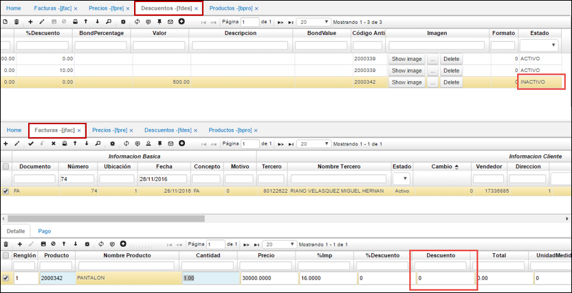

# Descuentos - FDES

Permite registrar los descuentos comerciales establecidos con los clientes.

**Id descuento:** consecutivo de la aplicación Descuentos.  
**Ubicación:** número de la ubicación de la empresa a la cual se va a agregar el descuento.  
**Tipo precio:** seleccionar tipo de precio correspondiente al tercero.  
**Tercero:** número de identificación del tercero al que se asigna el descuento.  
**Nombre tercero:** nombre del tercero al que se asigna el descuento.  
**Clasificación:** número de clasificación del producto al cual se le realizará descuento.  
**Nombre clasificación:** nombre de clasificación del producto.  
**Producto:** número asignado al producto previamente en la aplicación BPRO Productos.  

**Nombre producto:** nombre del producto al cual se realizará descuento.  
**Fecha inicial:** fecha inicial del descuento.  
**Fecha final:** fecha final del descuento.  
**Tipo descuento:** seleccionar el tipo de descuento que se va aplicar.  
**Precio:** precio del producto.  
**% descuento:** porcentaje de descuento que se va aplicar al producto.  

## [Parametrización liquidación por Vencimiento](http://docs.oasiscom.com/Operacion/scm/facturacion/fprecio/fdes#parametrización-liquidación-por-vencimiento)

Para hacer uso de la funcionalidad de descuentos para productos con fecha de vencimiento, se debe tener presente la siguiente configuracion en FDES.  

Se deben configurar aparte de las fechas de vigencia y tipo de descuento el rango de fechas de vencimiento que aplican para ese descuento.  

Con esta configuración según el rango de fechas de vencimiento el sistema tomará los descuentos correspondientes. Validamos lo anterior en la aplicación [**JFAC - Facturas**](http://docs.oasiscom.com/Operacion/scm/pos/jcajero/jfac#liquidación-por-vencimiento).

## [Motor de Promociones](http://docs.oasiscom.com/Operacion/scm/facturacion/fprecio/fdes#motor-de-promociones)

Este proceso consiste en la parametrización de tipos de descuentos que pueden ser aplicados a productos al momento de realizar algún movimiento en OasisCom. Los tipos de descuentos son los siguientes:  

* **Descuento en Valor:** es el descuento que se realiza al precio de un producto conforme a un valor determinado. _Por ejemplo:_  

  Sea un producto ‘X’ con precio $50.000, se realiza un descuento por valor de $10.000 sobre el precio del mismo, es decir, este producto queda a la venta con un precio de $40.000.  

* **Descuento por Precio:** consiste en el descuento que se realiza a un producto reduciendo el precio original del mismo. _Por ejemplo:_  

  Sea un producto ‘X’ con precio $30.000, desea dejarse para la venta a un descuento por precio de $20.000.  
  
* **Descuento por %:** consiste en el descuento que se realiza a nivel porcentual, descontando el porcentaje determinado al precio original del producto. _Por ejemplo:_  

  Sea un producto ‘X’ con precio $50.000 se deja a la venta con un descuento del 10%, es decir $45.000.  
 

 
* **Descuento por volumen en %:** este descuento consiste en la reducción porcentual del precio de un producto a los compradores que adquieren grandes cantidades del producto en cuestión. _Por ejemplo:_  
 
  Sea un producto ‘X’ con precio $10.000, si adquiere entre 5 y 15 unidades del mismo, se le hará un descuento del 20% sobre el valor total, es decir, si el comprador adquiere 10 unidades ($100.000) el 20% de descuento sobre este valor será $80.000.

* **Descuento por volumen en Valor:** este descuento (al igual que el descuento en valor) se realiza al precio de un producto de acuerdo con un valor estipulado, la diferencia radica en que este descuento es aplicado a compradores que adquieren grandes cantidades del producto en cuestión. _Por ejemplo:_  

  Sea un producto ‘X’ con precio $10.000, si el comprador adquiere entre 5 y 10 unidades del mismo, se le hará un descuento por valor de $20.000 pesos, es decir, si compra 10 unidades, su descuento será de $80.000.

* **Descuento en % con Control de Cantidad:** consiste a la aplicación de descuento porcentual sobre el precio de un producto para aquellos compradores que adquieran grandes cantidades. Este descuento únicamente será aplicable cuando el cliente lleve un acumulado determinado de unidades del producto (Tope). _Por ejemplo:_  

  Se aplica un porcentaje del 10% a aquel comprador que adquiera hasta 30 unidades del producto, sin pasarse de esta cantidad.

La parametrización de los tipos de descuento descrita se definirá a continuación:  

* Se debe realizar la creación de los tipos de descuentos en la aplicación [**FBTD - Tipos de Descuento**](http://docs.oasiscom.com/Operacion/scm/facturacion/fbasica/fbtd). (_Ver aplicación_) 
* Se deben crear los productos en la aplicación [**BPRO - Productos**](http://docs.oasiscom.com/Operacion/common/bprodu/bpro) y la lista de precios correspondiente en la opción [**FPRE - Precios**](http://docs.oasiscom.com/Operacion/scm/facturacion/fprecio/fpre). (_Ver aplicación_)  

Ahora, en la aplicación **FDES - Descuentos** se realiza la parametrización de los tipos de descuentos descritos anteriormente, así:  

### [Descuento en Valor](http://docs.oasiscom.com/Operacion/scm/facturacion/fprecio/fdes#descuento-en-valor)

Agregamos un nuevo registro y diligenciamos lo siguiente:  

**DiscountId:** se ingresa el Id del descuento. Se debe tener en cuenta que este Id no es un consecutivo, pero si debe ser un número exclusivo para cada registro.  
**DiscountName:** se debe ingresar el nombre del descuento. En este caso _Descuento en Valor_.  

**Ubicación:** se ingresa la ubicación en donde aplicará este descuento. Se debe tener en cuenta que, si se deja en ubicación **0**, esto quiere decir que este descuento aplicará para todas las ubicaciones.  

**T. Precio:** se debe diligenciar el tipo de precio que aplicará este descuento. Estos tipos de precio son una clasificación de los precios que pueden aplicar en las empresas.  

**Tipo Descuento:** se selecciona el tipo de descuento, teniendo en cuenta que el tipo de descuento a seleccionar debe concordar con la parametrización que desea realizarse. En este caso, por ejemplo, si el descuento es _Descuento en valor_, el tipo de descuento debe ser _Descuento en Valor_.  

**Tercero:** se ingresa el usuario al que aplicará este descuento. Se debe tener en cuenta que, si el tercero es **0**, quiere decir que esta parametrización aplica para todos los terceros.  

**Segment Id:** se selecciona el segmento al que pertenece el cliente seleccionado, es decir, hace referencia a una manera de clasificación de clientes.  

**Clasificación:** se diligencia el tipo de producto seleccionado.  

**Marca:** Se diligencia la marca del producto en cuestión para el que aplicará el descuento, teniendo en cuenta que, si se diligencia **0**, quiere decir que este descuento aplica para todas las marcas del mismo.  

**Línea:** se selecciona la línea del producto. Por ejemplo, si el producto corresponde a una camisa, este puede tener línea masculina, línea femenina, línea infantil, etc. Debe tenerse en cuenta que si la línea es **0** aplicará para todas las líneas.  

**Producto:** se debe ingresar el código del producto sobre el cual aplicará el descuento parametrizado, aquí pues se ingresa uno de los productos parametrizados anteriormente. Se debe tener en cuenta que, si el código del producto es **0**, quiere decir que aplica para todos los productos.  

En los campos **FechaIni** y **DateFinal** se debe ingresar la vigencia del descuento, es decir, de cuando a cuando esta parametrización será aplicable.  

El llenado de los campos **Precio**, **%Descuento**, y **Valor** dependen del descuento que se esté parametrizando. En este caso para el descuento por valor se diligencia el campo **Valor**.  

**Estado:** se ingresa _ACTIVO_ o _INACTIVO_ según corresponda.  

El descuento fue guardado exitosamente.  

Ahora, para verificar que efectivamente este descuento aplica para este producto, procedemos a realizar un movimiento en la aplicación **JFAC - Facturas**.  

Al momento de crear el registro maestro, se debe tener en cuenta que el campo **Ubicación** y **T. Precio** deben concordar con los parametrizados en el descuento en la opción **FDES**:  

Luego de guardar el registro maestro, se procede a diligenciar los datos del detalle:  

**Producto:** se ingresa el código del producto sobre el cual se desea realizar el movimiento. Ya sea seleccionando el código desde el zoom o ingresándolo manualmente y dando ‘tab’ para traer el resto de datos, se debe notar que en el campo **Descuento** se enseña el descuento en valor parametrizado en la opción FDES.  

Se debe tener en cuenta que si el estado del descuento es **INACTIVO** (opción FDES), no se aplicará el descuento y en la opción JFAC el campo **Descuento** será 0.  

### [Descuento en Precio](http://docs.oasiscom.com/Operacion/scm/facturacion/fprecio/fdes#descuento-en-precio)

**Id Descuento:** se ingresa el Id del descuento. Se debe tener en cuenta que este Id no es un consecutivo, pero si debe ser un número exclusivo para cada registro.  
**Nombre Descuento:** se debe ingresar el nombre del descuento. En este caso _Descuento en Precio_.  

Se realiza la misma dinámica igual que el descuento anterior, llenando los campos correspondientes. [**Ver descuento en Valor**](http://docs.oasiscom.com/Operacion/scm/facturacion/fprecio/fdes#descuento-en-valor).

**Producto:** se ingresa otro de los productos parametrizados anteriormente.  

Posteriormente, el valor para este tipo de descuento en precio se ingresa en el campo **Precio**, así:  

Por último, se guarda el registro con estado **ACTIVO**.  

Ahora, para verificar la correcta parametrización de este descuento, se realizará un movimiento en la opción **JFAC - Facturas**, para el producto parametrizado, así.  

Al momento de crear el registro maestro, se debe tener en cuenta que el campo **Ubicación** y **T. Precio** deben concordar con los parametrizados en el descuento en la opción FDES:  

Luego de guardar el registro maestro, se procede a diligenciar los datos del detalle:  

**Producto:** se ingresa el código del producto sobre el cual se desea realizar el movimiento.  

Ya sea seleccionando el código desde el zoom o ingresándolo manualmente y dando ‘tab’ para traer el resto de datos, se debe notar que en el campo **Precio** se enseña el descuento en valor parametrizado en la opción **FDES**.  

Se debe tener en cuenta que si el estado del descuento es **INACTIVO** (opción FDES), no se aplicará el descuento y en la opción **JFAC** el campo **Precio** será el ingresado en esta misma opción. En este caso como no se le colocó precio al producto, este será 0.  

  

### [Descuento en Porcentaje](http://docs.oasiscom.com/Operacion/scm/facturacion/fprecio/fdes#descuento-en-porcentaje)

**Id Descuento:** se ingresa el Id del descuento. Se debe tener en cuenta que este Id no es un consecutivo, pero si debe ser un número exclusivo para cada registro.  
**Nombre Descuento:** se debe ingresar el nombre del descuento. En este caso Descuento en porcentaje (%).  

Se realiza la misma dinámica igual que el descuento anterior, llenando los campos correspondientes. [**Ver descuento en Valor**](http://docs.oasiscom.com/Operacion/scm/facturacion/fprecio/fdes#descuento-en-valor).  

**Producto:** se ingresa otro de los productos parametrizados anteriormente.  

Posteriormente, el valor a descontar para este tipo de descuento en % se ingresa en el campo **%Descuento**, así: En este caso el descuento será del 10%.  

Por último, se guarda el registro con estado **ACTIVO**.  

Ahora, para verificar la correcta parametrización de este descuento, se realizará un movimiento en la opción **JFAC - Facturas**, para el producto parametrizado, así.  

Al momento de crear el registro maestro, se debe tener en cuenta que el campo **Ubicación** y **T. Precio** deben concordar con los parametrizados en el descuento en la opción **FDES**:  

Luego de guardar el registro maestro, se procede a diligenciar los datos del detalle:  

**Producto:** se ingresa el código del producto sobre el cual se desea realizar el movimiento.  

Ya sea seleccionando el código desde el zoom o ingresándolo manualmente y dando ‘tab’ para traer el resto de datos, se debe notar que en el campo **%Descuento** se enseña el descuento en valor parametrizado en la opción FDES.  

Se debe tener en cuenta que si el estado del descuento es **INACTIVO** (opción FDES), no se aplicará el descuento y en la opción JFAC - Facturas el campo **%Descuento** será 0.  

### [Descuento por volumen en porcentaje](http://docs.oasiscom.com/Operacion/scm/facturacion/fprecio/fdes#descuento-por-volumen-en-porcentaje)

