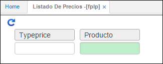

# Listado de Precios - FPLP

La lista de precios es una ayuda a la labor de ventas que ejercen los vendedores, lo que les permite trabajar y consultar estos listados y establecer el valor de las mercancías a ser enviadas a los clientes. Esta lista contiene el precio sugerido por la Empresa al efectuar la venta al Público lo que permite establecer el margen de ganancia que obtendrán los clientes al comercializar los artículos.

En esta aplicación se puede obtener un reporte por pantalla o por impresora de los precios de los productos de la empresa, puede ser consultado por; Tipo de precio y producto y en el reporte se puede observar la clasificación, marca, producto(s), código antiguo, código EAN, fecha de vigencia y precio, la lista siempre mostrara el P.V.P. de los productos.

