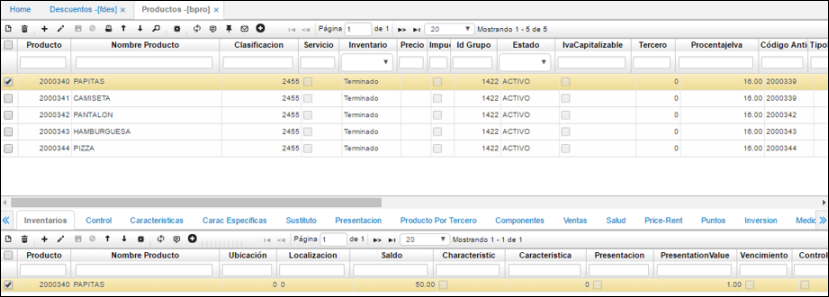
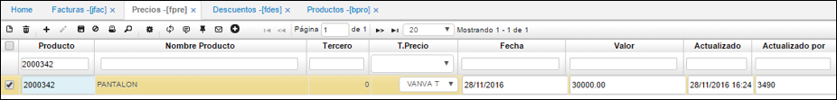

# Precios - FPRE

## Parametrización Descuentos

Primero se crearán varios productos y su respectiva lista de precios que servirán como ejemplo para realizar la parametrización de cada uno de los tipos de precio creados.  

En la aplicación **BPRO**, se realiza la creación de los productos a utilizarse para cada parametrización de los descuentos:

Debe tenerse en cuenta que para cada producto debe estar creada su respectiva lista de precios, esto se realiza en la opción **FPRE**, así:  

**Producto:** número asignado al producto en la aplicación **BPRO – Productos**.  
**Nombre Producto:** se diligencia automáticamente una vez ingresado el código del producto.  
**Tercero:** se ingresa el código o número de identificación del tercero (Cliente) al que aplicará esta lista de precios. En este caso, aplicará para todos los terceros.  
**T. Precio:** se debe diligenciar el tipo de precio del producto. Estos tipos de precio son una clasificación de los precios que pueden aplicar los terceros.  
**Fecha:** se diligencia la fecha sobre la cual empezará a ser vigente la lista de precios creada.  
**Valor:** se ingresa el precio el producto.  
**Actualizado** y **Actualizado por** se diligencian automáticamente una vez guardado el registro.  

Luego de realizar la creación de los productos a usar y la respectiva creación de las listas de precios para cada uno, se procede a realizar la parametrización de los descuentos en la aplicación [**FDES - Descuentos**](http://docs.oasiscom.com/Operacion/scm/facturacion/fprecio/fdes#motor-de-promociones). (_Ver aplicación_).  
