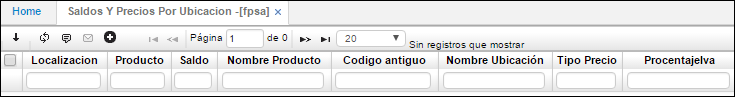

# Saldos y Precios por Ubicación - FPSA

La aplicación **FPSA** permite consultar los saldos y precios de los productos por ubicación.

**Localización:** Identificación numérica de la empresa u organización.  
**Producto:** Identificación numérica de los productos a consultar.  
**Saldo:** Saldo de productos por determinada ubicación.  
**Nombre producto:** Nombre de los productos consultados.  
**Código Antiguo:** Identificación antigua del producto si lo tiene.  
**Nombre ubicación:** Nombre de la ubicación en la cual se encuentra el producto.  
**Tipo precio:** tipo de precio que tiene asignado los productos.  
**Porcentaje IVA:** porcentaje de IVA correspondiente a los productos.  

