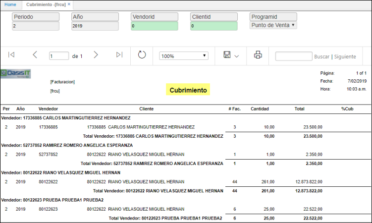

# Cubrimiento - FRCU

Reporte de facturación donde se valida la cantidad de clientes que posee un determinado vendedor en un periodo.  
Se utiliza para medir los porcentajes de cubrimiento del vendedor, en el módulo de facturación.
Establece numero de facturas, cantidad y totales.  
Permitiendo consultar por periodo, año, vendedor, cliente y programa.

