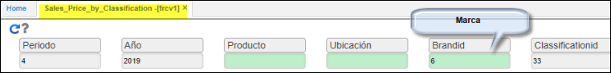
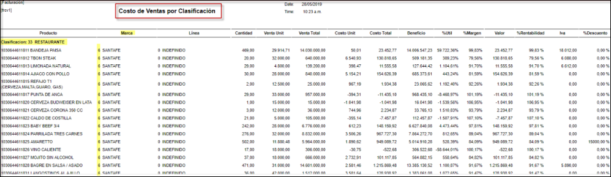

# FRCV1 - Costo de Ventas por Clasificación

Reporte de facturación, permite realizar filtros por clasificación, marca, ubicación; totaliza costos agrupados por clasificación.  
filtros de consulta:  

  

Este informe detalla el costo de venta unitario y total; discrimina el valor del IVA, descuentos realizados; porcentajes de rentabilidad, utilidad, margen entre otros.  

* Periodo: mes de la consulta.  
* Año: año que desea extraer los datos.  
* Producto: parametrizacion realizada desde **BPRO.**  
* Ubicacion: desde **BUBI** realiza la parametrizacion.
* Marca: **BMAR** basico de marcas.  
* Clasificacion: **BCLA** basico de Clasificacion.  

***********

