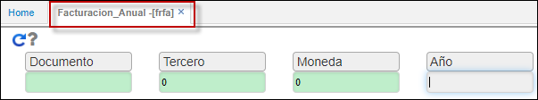

# - FRFA - Facturación Anual

Reporte que muestra la facturación de ventas resumida por año.  
Visualiza la informacion del modulo de facturacion anualizado por tercero, segun su tipo de moneda; extrae documentos de salida tipo venta o entrada tipo devoluciones.

Filtrar por documento, tercero, moneda y año y dar clic en Actualizar (Flecha azul).  

