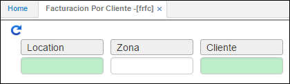
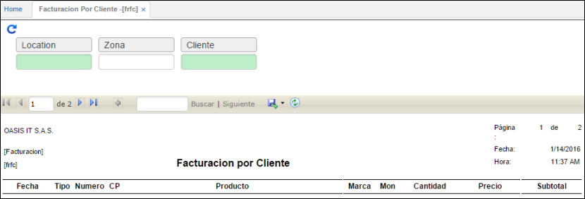

# Facturación por Cliente - FRFC

Es un reporte que detalla a cada uno de los clientes y su facturación efectuada en cada uno de los periodos, sirve como base para el análisis de la facturación por cliente, análisis de consumo, permite ver las diferentes líneas de venta y ubicaciones de facturación o venta.

**Ubicación:** Número de ubicación de la empresa dentro del sistema.  
**Cliente:** Identificación numérica del cliente de consulta.  

Reporte de la aplicación Facturación Por Cliente – **FRFC**.

