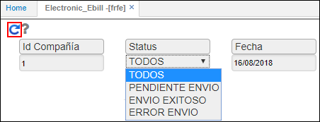
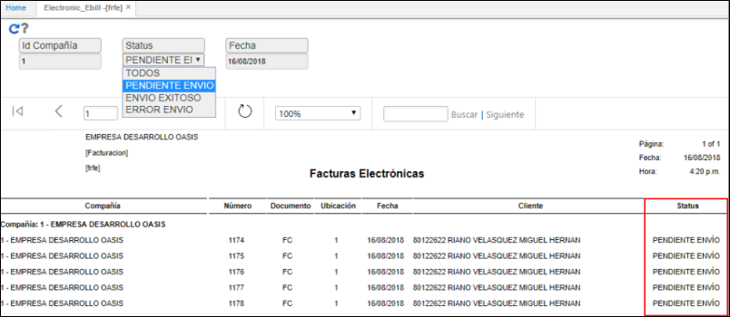

# FRFE - Reporte Facturación Electrónica

El reporte **FRFE** permite ver el estado de envío de las facturas electrónicas creadas por empresa.  

Ingresamos a la aplicación y filtramos por el número de compañía a consultar, seleccionamos el status de las facturas que se desean ver y la fecha. Damos click en el botón  _Generar_.  

Al consultar el reporte.  

