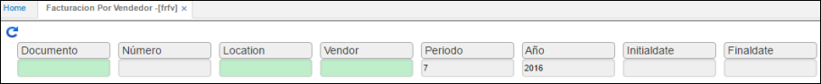

# Facturación por Vendedor - FRFV

Es un reporte que detalla a cada uno de los vendedores y su facturación efectuada en cada uno de los periodos, sirve como base para el análisis de la facturación por vendedor, rendimiento, permite ver las diferentes líneas de venta y ubicaciones de facturación o venta.

