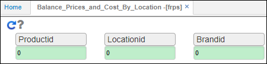
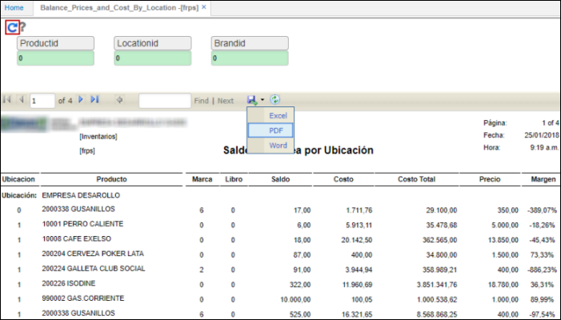

# FRPS - Saldos en Línea por Ubicación

El reporte **FRPS** muestra el listado de precios con saldos de inventario por ubicación.  

**Producto Id:** si se desea realizar la consulta por un producto en específico, digitamos el ID o seleccionamos del zoom el producto necesario. Si la consulta es para todos los productos ingresamos el número cero (0).  
**Ubicación Id:** digitar o seleccionar del zoom la ubicación de donde se desea hacer la consulta. si la consulta se realizará para todas las ubicaciones, ingresamos el número cero (0).  
**Marca Id:** ingresar el id correspondiente a la marca de consulta. Digitar 0 si la cosnulta es para todas las marcas.  

Ingresados los datos damos click en el botón  y el sistema arrojará el reporte, el cual puede ser descargado en formato Word, PDF o Excel.  

