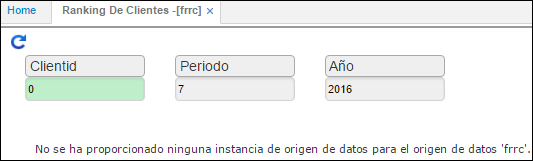

# Ranking de Clientes - FRRC

Esta opción consolida la facturación de los diferentes clientes efectuados en los respectivos periodos o meses ordenándolos de mayor a menor por los montos facturados, esta consulta se permite efectuar de varias formas una de ellas los clientes con facturación en determinado mes con valor total facturado superior a un monto predeterminado, el reporte totaliza los montos facturados y asigna automáticamente un porcentaje de participación en facturación respecto al total.

