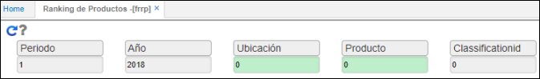
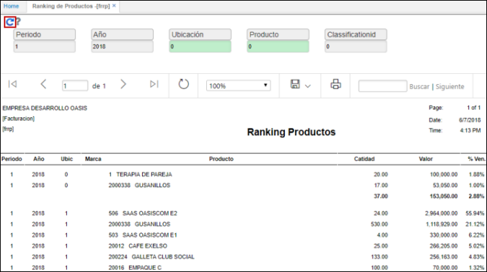
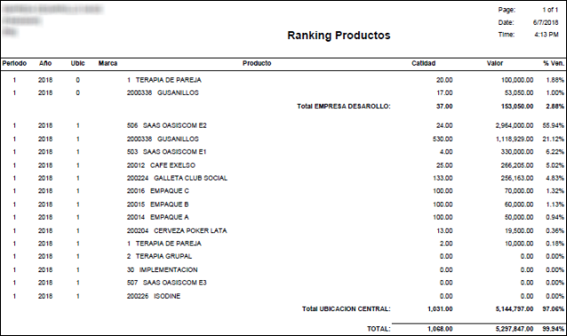

# Productos Ranking - FRRP

Esta opción consolida la facturación efectuada en los respectivos periodos o meses de los diferentes productos, ordenándolos de mayor a menor por los montos facturados, esta consulta se permite efectuar de varias formas una de ellas los productos y su facturación en determinado mes con valor total facturado superior a un monto predeterminado, el reporte totaliza los montos facturados y asigna automáticamente un porcentaje de participación en facturación respecto al total.

**Periodo:** si se requiere consultar por periodo, ingresar el mes requerido.  
**Año:** ingresar el año de consulta.  
**Ubicación:** ingresar la ubicación de donde se desea consultar los productos.  
**Producto:** si la consulta es específica de un producto, ingresar o seleccionar del zoom el ID del mismo.  
**Clasificación:** si se requiere consultar los productos por clasificación.  

Reporte exportado en PDF.  

