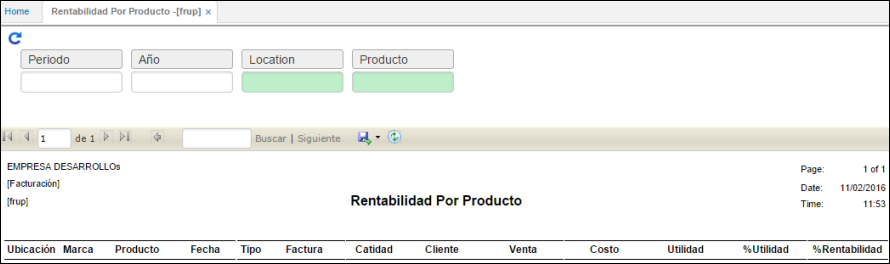

# Rentabilidad del Producto - FRUP

La aplicación calcula con base en lo facturado el margen de rentabilidad de los productos, ordena por producto, cantidad, cliente, venta, costo, utilidad, entre otras.

Permite filtrar por periodo, año, ubicación y producto.

