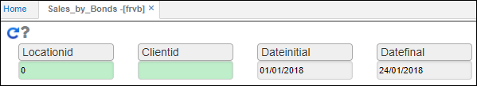
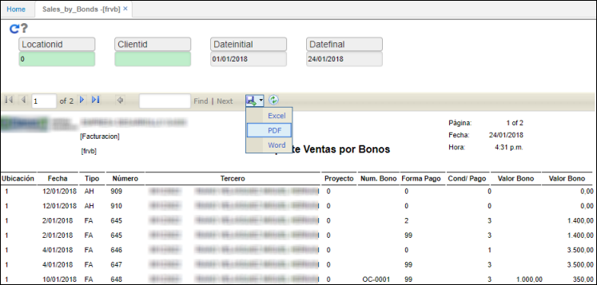

# FRVB - Ventas por Bonos

El reporte **FRVB** permite consultar la facturación que ha sido realizada con bonos.  

**LocationId:** digitar o seleccionar del zoom la ubicación de la cual se va hacer la consulta.  
**ClientId:** si la consulta se requiere hacer sobre un cliente en específico, ingresamos el número de identificación del mismo, de lo contrario dejamos en blanco para hacer una consulta general.  
**Fecha inicial:** seleccionar la fecha inicial desde donde se requiere hacer la consulta.  
**Fecha final:** seleccionar la fecha final hasta donde se requiere sea la consulta.  

Ingresamos los datos anteriores y damos click en el botón .

La aplicación arrojará el reporte correspondiente. El reporte podrá ser descargado en Excel, PDF o Word.  

