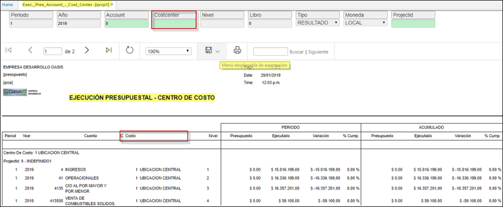

# Ejecución Presupuestal por Centro de Costo - QVCP1

La aplicación **QVCP1**  - Permite también hacer la comparación mes a mes de las expectativas presupuestadas de ingresos y egresos de la empresa o de un centro de costos, frente a los resultados obtenidos realmente.
Incluye un amplio conjunto de informes donde se pueden comparar los saldos ejecutados con los presupuestados ya sea de un mes, de un periodo específico o con el presupuesto del año. Además, permite visualizar los informes a nivel de toda la empresa o de un centro de costos en particular.  

