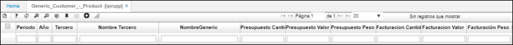

# Generic  Customer - Product - QVCPP

La aplicación Cliente – Producto **QVCPP** permite visualizar de forma generica que cliente adquirió que producto, describiendo la cantidad de productos facturados a dicho cliente y el valor total de facturación. Igualmente en caso de devolución, arroja la cantidad de productos devueltos y el valor total de devolución.

**Periodo:** Mes de consulta.  
**Año:** Año de consulta.  
**Tercero:** Identificación del cliente al cual se le facturo.  
**Nombre tercero:** Nombre del cliente.  
**Producto:** Identificación del producto facturado.  
**Nombre producto:** Nombre del producto facturado.  
**Facturación cantidad:** Cantidad de productos facturados.   
**Facturación valor:** Valor total de los productos facturados.  
**Cantidad devolución:** Cantidad de productos devueltos.  

