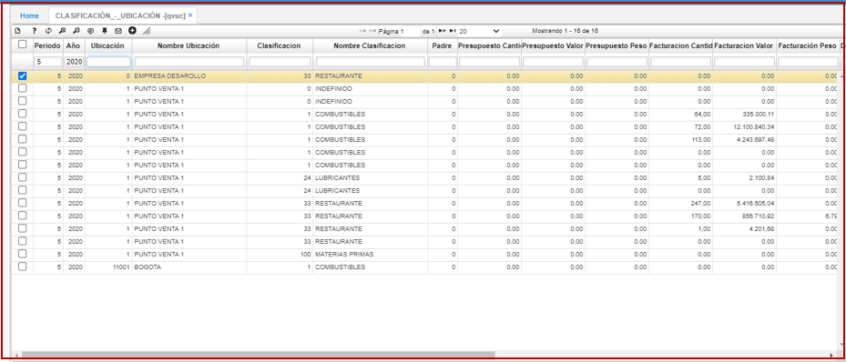

# Cliente - Ubicación - QVCU

La aplicación **QVCU**  - Cliente y Ubicacion, permite visualizar las ubicaciones, describiendo la cantidad de productos facturados y el valor total de facturación.

**Periodo:** Mes de consulta.  
**Año:** Año de consulta.  
**Ubicacion** ubicacion empresarial donde se origina el documento.  
**Clasificación:** Número de clasificación de los productos.  
**Nombre clasificación:** Nombre de clasificación de productos.  
**Facturación cantidad:** Cantidad de productos facturados.  
**Facturación valor:** Valor total de los productos facturados.  
