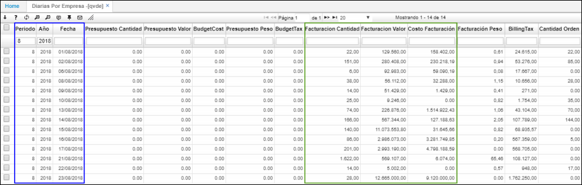

# QVDE - Diarias por Empresa

La aplicación **QVDE** permite consultar la relación de ventas diarias por ubicación (por empresa).  

Podemos filtrar por mes, año y fecha para una consulta más exacta. El sistema reflejará la información de la empresa en la cual se encuentre logueado el usuario en sesión.  

Podremos ver la cantidad de facturación realizada en el día de consulta, el valor de dicha facturación y el costo, entre otra información.  